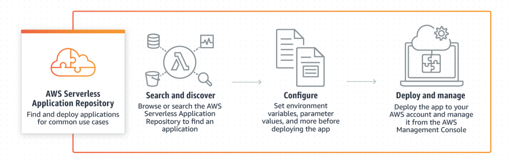
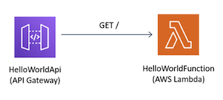
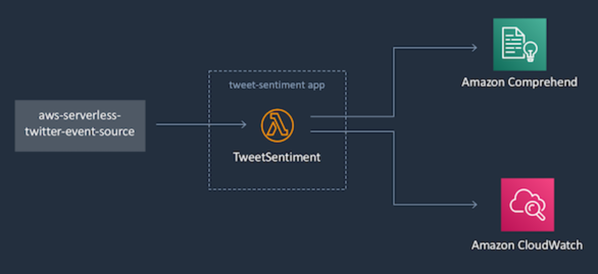
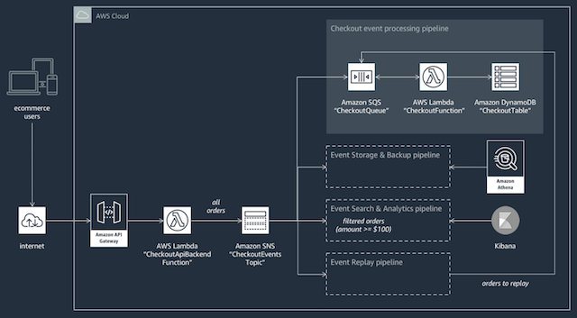
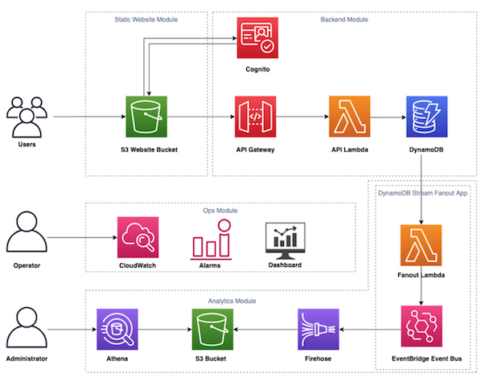

# Microservices composition

#Amazon Web Services approach using Serverless Application Repository (SAR)and Serverless Application Model (SAM)

AWS approach to microservices composition leverages two AWS main components which are AWS Serverless Application Model (SAM) and AWS Serverless Application Repository. 

AWS SAM
AWS defines SAM as: 

*"An open-source framework for building serverless applications. It provides shorthand syntax to express functions, APIs, databases, and event source mappings. With just a few lines per resource, you can define the application you want and model it using YAML. During deployment, SAM transforms and expands the SAM syntax into AWS CloudFormation syntax, enabling you to build serverless applications faster."*

AWS SAM and AWS Cloudformation an AWS implementation of the concept of infrastructure as code, which basically consists in defining resources to be deployed in an AWS account using a well defined syntax inside a template using YAML or JSON format.

Example of SAM template definition:

	AWSTemplateFormatVersion: '2010-09-09'
	Transform: 'AWS::Serverless-2016-10-31'
	Description: 'Sample SAM Template for serverless app'
	Globals:
  		Function:
    		Timeout: 3
	Resources:
	  MylambdaFunction:
    # Define resource as Lambda function.
    	Type: 'AWS::Serverless::Function'
    
    	Properties: 
      		# Set Nodejs v8.10 as lambda function runtime.
      		Runtime: nodejs8.10
        
      		# Defines Lambda function's handler.
      		Handler: index.handler
      
      		# Lambda function code location
      		CodeUri: ./src
      
      # Event sources to attach to this function. In this case, we are attaching
      # one API Gateway endpoint to the Lambda function. The function is
      # called when a HTTP request is made to the API Gateway endpoint.
      Events:
      
      # Define an API Gateway endpoint that responds to HTTP GET at /resource
      		MyApi:
 				Type: Api
				Properties:
                	Path: /resource
                	Method: GET
  		MyApp1:
    		Type: AWS::Serverless::Application
    		Properties:
      			Location:
        			ApplicationId: 'arn:aws:serverlessrepo:us-east-1:012345678901:applications/my-application'
        			SemanticVersion: 1.0.0
      			Parameters:
        			StringParameter: parameter-value
        			IntegerParameter: 2
  		MyApp2:
    		Type: AWS::Serverless::Application
    		Properties:
      			Location: <url_to_sam_template_on_s3_bucket>
	Outputs:
  		MyNestedAppOutput:
    		Value: !GetAtt MyApp1.Outputs.ApplicationOutputName
    		Description: Example nested app output

AWS Serverless Application Repository (SAR)

The AWS Serverless Application Repository is a managed repository for serverless applications. It enables teams, organizations, and individual developers to store and share reusable applications, and easily assemble and deploy serverless architectures in powerful new ways. Using the Serverless Application Repository, you don't need to clone, build, package, or publish source code to AWS before deploying it. Instead, you can use pre-built applications from the Serverless Application Repository in your serverless architectures, helping you and your teams reduce duplicated work, ensure organizational best practices, and get to market faster.

#AWS microservices composition example 1

The first example that we look at is a sample HelloWorld application implements a simple API backend. The resources to be deployed are an API Gateway endpoint and a Lambda function. The app performs a very basic functionality which is to service When a user's GET request sent to the API Gateway endpoint, which then triggers the invokation of the lambda function that returns a hello world message.

<https://docs.aws.amazon.com/serverless-application-model/latest/developerguide/serverless-getting-started-hello-world.html>

The SAM template to deploy the needed resources will look like this:

	AWSTemplateFormatVersion: '2010-09-09'
	Transform: 'AWS::Serverless-2016-10-31'
	Description: 'sam-app Sample SAM Template for sam-app'
	Globals:
  	Function:
    	Timeout: 3
	  	HelloWorldFunction:
  		Description: Hello World Lambda Function ARN
    	Value:
    		Fn::GetAtt:
      		- HelloWorldFunction
      		- Arn
	HelloWorldFunctionIamRole:
		Description: Implicit IAM Role created for Hello World function
		Value:
			Fn::GetAtt:
      		- HelloWorldFunctionRole
      		- Arn
	Resources:
  		HelloWorldFunction:
    		Properties:
      			CodeUri: HelloWorldFunction
				Events:
					HelloWorld:
          			Properties:
            				Method: get
            				Path: /hello
          			Type: Api
      			Handler: app.lambda_handler
      			Runtime: python2.7
    		Type: AWS::Serverless::Function
    	#nested application	
  		lambdaauthorizerbasicauth:
    		Type: AWS::Serverless::Application
    		Properties:
      			Location:
        			ApplicationId: arn:aws:serverlessrepo:us-east-1:560348900601:applications/lambda-authorizer-basic-auth
        			SemanticVersion: 0.2.0       
  		MyApi:
    		Type: AWS::Serverless::Api
    		Properties:
      			StageName: Prod      
      			Auth:
        			DefaultAuthorizer: MyLambdaRequestAuthorizer
        			Authorizers:
          			MyLambdaRequestAuthorizer:
            				FunctionPayloadType: REQUEST
            				FunctionArn: !GetAtt lambdaauthorizerbasicauth.Outputs.LambdaAuthorizerBasicAuthFunction
            				Identity:
              				Headers:
                				- Authorization
		HelloWorld:
    		Type: Api
    		Properties:
      			Method: get
      			Path: /hello
      			RestApiId: !Ref MyApi
      			Auth:
        			Authorizers: MyLambdaRequestAuthorizer
	Outputs:
	  HelloWorldApi:
	    Description: API Gateway endpoint URL for Prod stage for Hello World function
	    Value:
	      Fn::Sub: https://${MyApi}.execute-api.${AWS::Region}.amazonaws.com/Prod/hello/

In the above template, the microservice lambda-authorizer-basic-auth has been found from the AWS SAR as a microservice that fits the requirements for securing our helloWorld app API. The block code for the microservice is copied as SAM template from SAR and added as nested block into my template to provide the added functionality.  

	lambdaauthorizerbasicauth:
			# Type AWS::Serverless::Application defines a nested application
    		Type: AWS::Serverless::Application
    		Properties:
      			Location:
        			ApplicationId: arn:aws:serverlessrepo:us-east-1:560348900601:applications/lambda-authorizer-basic-auth
        			SemanticVersion: 0.2.0       

To deploy this template into my AWS account I need to run the following commands from my local machine where I already installed AWS sam cli:

	#Package the application
	sam package --template-file template.yaml --output-template packaged-output.yaml --s3-bucket <my-s3-bucketname>

	#Deploy the application
	sam deploy --template-file packaged.yaml --<AWS region> --stack-name TestApp --capabilities CAPABILITY_IAM CAPABILITY_AUTO_EXPAND

If I test the HelloWorld API as a standalone application without the authorizer in my local machine it works.

	(base) 186590dda78b:sam-app gleschen$ sam local invoke --no-event
	2019-11-18 18:06:13 Found credentials in shared credentials file: ~/.aws/credentials
	2019-11-18 18:06:13 Invoking app.lambda_handler (python2.7)

	Fetching lambci/lambda:python2.7 Docker container image.......................................
	2019-11-18 18:06:19 Mounting /Users/gleschen/sam-app/.aws-sam/build/HelloWorldFunction as /var/task:ro inside runtime container
	START RequestId: f4aeebb9-76bd-1e40-10c6-75674cd5244e Version: $LATEST
	END RequestId: f4aeebb9-76bd-1e40-10c6-75674cd5244e
	REPORT RequestId: f4aeebb9-76bd-1e40-10c6-75674cd5244e	Init Duration: 27.35 ms	Duration: 16.51 ms	Billed Duration: 100 ms	Memory Size: 128 MB	Max Memory Used: 21 MB	

	{"body":"{\"message\": \"hello world\"}","statusCode":200}
	(base) 186590dda78b:sam-app gleschen$ 

However if I test the composed app deployed in my AWS account, I would need to have the correct credentials otherwise I get an authorized error as shown below:
		
	#Testing without credentials
	(base) 186590dda78b:sam-app gleschen$ curl https://e4aqvihhw0.execute-api.eu-west-1.amazonaws.com/Prod/hello/
	{"message":"Unauthorized"}

	#Testing with correct credentials	
	(base) 186590dda78b:sam-app gleschen$ curl -u testuser:1234 https://e4aqvihhw0.execute-api.eu-west-1.amazonaws.com/Prod/hello/
	{"message": "hello world"}
	
#AWS microservices composition example 2

Twitter search app tha connect a twitter api to search for tweets and then invoke a lambda function to performs processing on the retrieved tweets.

SAM template

	AWSTemplateFormatVersion: '2010-09-09'
	Transform: 'AWS::Serverless-2016-10-31'
	
	Parameters:
	  LogLevel:
	    Type: String
	    Description: Log level for lambda function logging
	    Default: INFO
	Resources:
	  TweetProcessor:
	    Type: AWS::Serverless::Function
	    Properties:
	      CodeUri: .
	      Handler: mylambdafunction.handler
	      Runtime: python3.7
	      Timeout: 60
	      Environment: 
	        Variables: 
	          LOG_LEVEL: !Ref LogLevel
	  TweetEventSource:
	    Type: AWS::Serverless::Application
	    Properties:
	      Location:
	        ApplicationId: arn:aws:serverlessrepo:us-east-1:771389557967:applications/TweetEventSource
	        SemanticVersion: 0.0.2
	      Parameters: 
	        ProcessorFunctionName: !Ref TweetProcessor
	        # Search query to be passed to Twitter to select tweets to use for the event source.
	        SearchQuery: '#microservice -filter:nativeretweets'  

The TweetEventSource published in the SAR <https://serverlessrepo.aws.amazon.com/applications/arn:aws:serverlessrepo:us-east-1:771389557967:applications~TweetEventSource> application provides a functionality that is needed to augment the capability of the tweetProcessor application, so I am using the same process (nested stack inside SAM template) as before compose the two applications into a single app.

#AWS microservices composition example 3

The third example is a simple ecommerce application that enables customers to select a product and pay for it. The payment functionality is provided by a microservice published on the AWS SAR (<https://serverlessrepo.aws.amazon.com/applications/arn:aws:serverlessrepo:us-east-1:375983427419:applications~api-lambda-stripe-charge>), which can be copied and embedded onto the SAM template of the frontend microservice.

SAM template:

	AWSTemplateFormatVersion: '2010-09-09'
	Transform: AWS::Serverless-2016-10-31
	Description: simple ecommerce service
	Globals:
	  Function:
	    Timeout: 3
	Resources:
	  ShowProduct:
	    Type: AWS::Serverless::Function
	    Properties:
	      Handler: index.handler
	      Runtime: nodejs8.10
	      Timeout: 10
	      Events:
	        Api:
	          Type: Api
	          Properties:
	            Path: /product/{productId}
	            Method: GET
	      CodeUri: s3://my-appcomposition-bucket/84da25814ed6d6f674f263c7892fc396
	  apilambdastripecharge:
	    Type: AWS::Serverless::Application
	    Properties:
	      Location:
	        ApplicationId: arn:aws:serverlessrepo:us-east-1:375983427419:applications/api-lambda-stripe-charge
	        SemanticVersion: 3.0.0
	      Parameters:
	        CorsOrigin: '*'
	Outputs:
	  ApiUrl:
	    Value:
	      Fn::Sub: https://${ServerlessRestApi}.execute-api.${AWS::Region}.amazonaws.com/Stage/product/123
	    Description: The URL of the sample API Gateway

#AWS microservices composition example 4 

This example is a basic http microservice endpoint that performs read/write to DynamoDB with a RESTful API endpoint using Amazon API Gateway. The composition is done with another microservice that takes the data written to the table as input to make another http request to the API gateway endpoint.

SAM template:

	AWSTemplateFormatVersion: '2010-09-09'
	Transform: 'AWS::Serverless-2016-10-31'
	Resources:
	  BasicLogTable:
	    Type: AWS::Serverless::SimpleTable
	    Properties:
	        SSESpecification:
	          SSEEnabled: true
	        TableName: basic-log-table
	        PrimaryKey:
	          Type: String
	          Name: username
	  Microservicehttpendpoint1:
	    Type: AWS::Serverless::Application
	    Properties:
	      Location:
	        ApplicationId: arn:aws:serverlessrepo:us-east-1:077246666028:applications/microservice-http-endpoint
	        SemanticVersion: 1.0.3
	      Parameters: 
	        TableNameParameter: !Ref BasicLogTable  
	  Microservicehttpendpoint2:
	    Type: AWS::Serverless::Application
	    Properties:
	      Location:
	        ApplicationId: arn:aws:serverlessrepo:us-east-1:077246666028:applications/microservice-http-endpoint
	        SemanticVersion: 1.0.3
	      Parameters: 
	        TableNameParameter: !Ref BasicLogTable  
            
#AWS microservices composition example 5 - WSO2 with Ballerina 

A Travel agency that manages tours for tourists needs to issue and airline ticket reservation, book a hotel room and car rental. The hotel, airline and car rental services are all external services to the travel agency service as illustrated in the following diagram:

Details of the composition approach are described in the following github repository readme file:
<https://github.com/ballerina-guides/service-composition>

#AWS microservices composition example 6 - Medley domain specific language (DSL)

The Medley DSL allows users to declare and configure processes to use and to compose. In particular, the Medley DSL enables users to express how to compose processes altogether according to the events that can occur on their respective output streams. 

The code extract below gives an overview of a composition of a set of processes. 

The code block below describes a composition that periodically (line 2, 13) checks for new high-priority issues created on a specific GitHub 2 repository. If a new issue is detected, it notifies the user by sending her an email containing the issue’s URL.The email service is selected from a pool of interchangeable services, enabling fault-tolerance on service unavailability. It also notifies the user if an error is encountered with the GitHub service when polling for new issues. Furthermore,this example enables us to highlight some key language operators of the Medley DSL, and concepts of the Medleyplatform. (E. Ben Hadj Yahia et al., 2016)

	 composition {
	2 	process tick = require("Medley/Tick");
	3 	process getNewIssues = require("Github/GetNewIssues");
	4 	getNewIssues.init({"credentials": "<label>"});
	5 	process gmail = require("Gmail/SendEmail");
	6 	process outlook = require("Outlook/SendEmail");
	7 	// ...
	8 	pool process sendEmail = require("Medley/Pool");
	9 	sendEmail.add(gmail, outlook);
	10 	sendEmail.init({"strategy": "round-robin"});
	11 	on (tick:out) do {
	12 		stream issues = getNewIssues.invoke({
	13 			"repository": "medley/repo"
	14 		});
	15 		on (issues:out as issue) do {
	16 			if ({{$.issue.priority}} == "high") {
	17 				sendEmail.invoke({
	18 					"to": "john@doe.com",
	19 					"body": "New issue: {{$.issue.url}}"
	20 				});
	21 			} }
	22 			on (issues:err as error) do {
	23 			 sendEmail.invoke({
	24 				"to": "john@doe.com",
	25 				"body": "Error encountered while fetching new issues: {{$.error.message}}"
	26 			});
	27 } } }
#More examples

##Tweet sentiment Analysis
This application is composed with the twitter event source app to processes tweets for a given Twitter search, calls Amazon Comprehend to do sentiment analysis on the tweet text, and publishes the sentiment scores as custom metrics to Amazon CloudWatch Metrics.

Architecture

SAM template: <https://github.com/jlhood/tweet-sentiment-python/blob/master/template.yml>

Full details and installation guide available in the following GitHub repo:
<https://github.com/jlhood/tweet-sentiment-python>

##eCommerce example:

Architecture:

Deployment instructions:

<https://github.com/aws-samples/aws-serverless-event-fork-pipelines/blob/master/examples/ecommerce-app/checkout-api/README.md>

##Real world serverless example

Architecture:

Deployment instructions:

<https://github.com/awslabs/realworld-serverless-application>

#Common patterns 
Events

API

Middleware (Queue system, notification service, integration adapter)

#References

1. Yahia, E. B. H., Réveillère, L., Bromberg, Y.-D., Chevalier, R., & Cadot, A. (2016). Medley: An Event-Driven Lightweight Platform for Service Composition. Lecture Notes in Computer Science Web Engineering, 3–20. doi: 10.1007/978-3-319-38791-8_1

2. <https://docs.aws.amazon.com/serverless-application-model/latest/developerguide/serverless-sam-template.html>

3. <https://github.com/ballerina-guides/service-composition>

4. <https://serverlessrepo.aws.amazon.com/applications/arn:aws:serverlessrepo:us-east-1:375983427419:applications~api-lambda-stripe-charge>

5. <https://docs.aws.amazon.com/serverless-application-model/latest/developerguide/serverless-getting-started-hello-world.html>

6. <https://aws.amazon.com/serverless/sam/>
7. <https://aws.amazon.com/serverless/serverlessrepo/>
