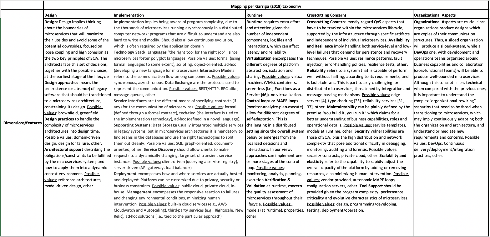
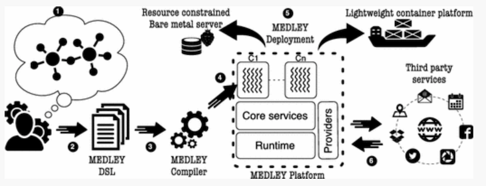

# PhD - End of Year 1 Probation Report

This report summarises the work that I have undertaken in the first year of my PhD research and is designed to demonstrates to the probabtion panel that I have made sufficient progress and I am on track to complete my PhD within the maximum time (October 2024) allowed by the University. it is organized as follows:

- A summary of the research problem
- A Summary of the methodoloy
- A summary of the SLR results
- A summary of the analysis of microservices patterns 
- Examples of microservices composition 
- Limitations & Challenges
- Next steps

## Research problem

The research problem that I'm trying to solve as part of this PhD research is to design a novel approach to composing microservices that demonstrates some level of efficiciency (development time, cost) and Quality of service (total request time) in comparison to existing approaches. 

Microservices are attracting a lot of interest in academia where a lot of microservices-related research work have been conducted since microservices began to emerge in the 90's replacing web services and service oriented architecture (SOA). There is a tight relation between SOA and microservices which some researchers referred to as SOA done right. There's also a lot of interest on microservices in the industry as many companies are looking to adopt modern applications and move away from legacy systems. Such transformation implies a major cultural shift with traditional approaches to managing application developement projects such as waterfall having to give way to agile methods, which are more suitable to new paradigms such as CI/CD/ (Continous Integration/Continous Development) or DevOps/DevSecOps whereby applications are build in small chunks generally aligned to business capabilities and deployed/updated independently and in short cycles. In environments where the aforementioned paradigms are implemented, teams have more autonomy with the ability to build, deploy, manage specific functionalities of an application and evolve the parts that they control (build and operate) independently. 

From a technological, architectural and design standpoint the change from legacy systems to modern applications is mainly about changing from monolith applications to microservices. In Monilith architecture, applications' functionalities are contained in a single large piece of code which means every time there is a need to change something within the application (e.g adding a new features), the entire code needs to be recompiled and tested, this makes changes very cumbersome and costly and in today's rapidly changing environment this can no longer be a viable proposition. On the contrary Microservices which are self-contained and built around a single functionality help provide agility and fast time to market which are key ingredients to change and innovation.

How microservices are tied together into an application in order to fulfill a specific use case is referred to a service composition, which is the main purpose of this research and in the following I will present a summary of the progress that have been done so far.

## 1. Systematic literature survey
The research problem requires having a deep understanding of how microservices composition is done which would help grasp the technicalities of the current approaches to composing microservices as well as the frameworks and algorithms used in existing composition methods. In order to get such understanding, I conducted a systematic literature review (SLR), whose objectives are: (i) to review primary studies that meet a set of criteria, and extract relevant information pertaining to the composition of microservices, and to (ii) conduct an analysis on the extracted data to identify patterns and insights from existing studies to drive further research where there is a gap or augment an existing approach. The SLR attempts to answer the following research questions:

RQ1: What are the current approaches to microservices composition?

RQ2: Which frameworks are used to compose microservices?

## Methodology

I started by identifying a number of seed papers that discussed the topic of microservice composition. The seed papers were found from a list of studies that were already I had already read and knew they were relevant to the research topic.. Initially, I started with 10 papers to which I applied the snowballing process which helped find an additional 15 relevant papers to complete the list. The seeds papers were manually retrieved by way of a manual search on the databases selected for this study including: Scopus, Springer, Science Direct and Google Scholar.

I built a search query using keywords from the research questions and through several iterations of reviews with my supervisors and a query validation process, I refined the search query to the following:

*(“microservice” OR “micro-service” OR “micro service”) AND (“composition” OR “choreography” OR “orchestration”) AND (“framework” OR “architecture”)*

I ran the query on selected journals and was able to extract 2310 studies from the initial search, and after removing duplicates, I ended up with 2296 papers. I then read the titles and abstracts of each one of the 2296 papers and applied the inclusion/exclusion criteria to each one of them, which led to the exclusion of another 2,161 papers with 135 remaining.. The next step consisted in reading each one of the 135 papers in full for a more rigorous application of the IC/EC criteria. In the end, 57 papers were found to be relevant to our SLR and set the final scope in which the data pertaining to the RQs were going to be found. The full SLR is included in Annex A so I will only provide a summary of the results in the next paragraphs together with few examples of microservices composition approaches and frameworks.

### Summary of the SLR results

I looked at microservices composition methods from three lenses: i. How the collaboration between microservices is managed ii. The intelligence of the composition which includes things like the discovery of composites microservices, communication methods, coordination of tasks to fulfill a given business function). And iii. From a taxonomy of microservices using Garriga's taxonomy.

**RQ1**: The chart below shows that below shows that 41% of the selected papers use orchestration as a method for composing microservices, making it the most popular of all the methods in the selected studies. The second most used method is choreography which accounts for 20% of the papers. The study shows that 11% of the papers use a hybrid approach which is a combination of orchestration and choreography. Another method known as decentralized process is also used as a way of composing microservices albeit to lesser extend as it only accounts for 2% of our selected studies. The remaining 26% of the papers are classified as unspecified as they use neither orchestration, nor choreography or both (hybrid).

below shows that at 22% of our studies, the model-based approach is the microservices composition method that is the most popular followed by a number of methods (8 in total) that are within 5 and 10% of range of the selected studies. These include: the semantic annotation (9%), container-based (8%), agent-based and programming language specific each reprsenting 7% of the papers, event-driven (6%), domain-specific language and cloud based approaches (5% each). The least used methods include those based on Labelled Transition Systems (LTS), ML-based, client based, contract-based, micron-based, API-based with each representing 1% of the studies.

**RQ2**: As shown in the chart below shows, there are 33 frameworks used to compose microservices, of which semantic annotation is the one mostly used which 5 out of the 57 selected papers. The next most used the Domain Specific Language (DSL) based and the ad hoc approach which is basically include any method of building microservices-based applications by developers without following any particular logic other the ones provided by programming languages they use. There are 6 frameworks (BPMN, Jolie programming, DSML, MDE, Web framework and g-choreography) that are used each in 2 studies. The remaining frameworks which are the majority (approximately 70% of the 33) are used each in only one study.

The results show that ad-hoc approaches to microservices composition are still the most widely used, which indicates that the developers's knowledge and experience in a particular programming language dictate how microservices are composed into applications. While this can be seen as an advantage in respect to the variety of programming languages that are available which help provide flexibility, 
some studies demonstrates that frameworks such as BPMN provide better QoS (faster response time of requests than ad hoc approaches). Purposely designe composition frameworks also allow for easy and faster implementation of changes which makes them a good candidate for industry adoption which remains one of their biggest limitations. The fact that the highest number of frameworks use known technology such semantic annotation, DSL, labelled transition systems and widely use modelling language such as UML and BPMN as well as common protocols such as HTTP, JSON, WDSL, RPC as opposed to using proprietary or purposely designed for microservice composition, make the wide adoption through common standards an achievable task. Some of the composition methods and frameworks are made of a combination of methods and or other frameworks which allows some optimization by bringing together the strengths of individual methods. Because most composition methods and frameworks are implemented using common technologies, they naturally inherit the strengths and the limitation of these underlying technologies. This is for example the case of agent-based composition which is discussed in one of the paper as costly due to extra processing overhead but reliable thanks to offline capabilities preventing loss of data, which is generally observed in agent-based systems as opposed to agentless ones. .
The results show that a significant number of frameworks are designed or tested for the cloud and containers as opposed to on-premise environment.

The analysis of the composition approaches based on Garriga's taxonomy of microservices demonstrate that all 5 dimensions (design, implementation, runtime, cross-cutting concerns and organizational aspects) and their sub-dimensions are covered, including security albeit to a lesser extent. The mapping also demonstrates that a variety of programming languages are used which confirms the flexibility of microservices in terms of the technology that can be used to building them. Relational databases are the data storage that is the most used across the selected paper with only 3 studies providing the option to use either SQL or NoSQL database. The data also show that when it comes to the implementation of capabilities such as service discovery, load balancing and Fault tolerance, NetFlix family of products (NetFlix Eureka, NetFlix Ribbon) are the most common. While on a design standpoint, model-based design approaches appear to be the most widely used (8 in total) followed by the agent-based (4 studies)

While these results help gather useful statistics on the how the framework maps to the taxonomy, it is worth clarifying that this is just an observation based on statistics from the data gathered in this SLR and the studies do not provide enough details to generalise conclusions. For instance on the choice of data store, it is difficult to ascertain that the choice of SQL is related to the type of use case or is generically best suited to the composition by design, or whether the preference for NetFlix products is related to their capabilities or because they are open source technologies. Only further studies would help generalise the results and this is beyond the scope of this SLR.

## Results of the analysis of microservices patterns
In the second part of phase one of my research, I conducted an empirical study by examining a sample of 50 microservices-based applications mainly open source randomly selected from GitHub by running a search on the keyword "microservice". For this part, I used Taibi et al. (2018) systematic mapping study on architectural patterns for microservice and the work of Marquez et al. (2018) who identify 15 microservices patterns. The graph below shows the number of occurence in the microservice architectue. We can see that containers, cloud and API gateway are the most used patterns across the sample of microservices used for my study. In terms of data storage, Taibi et al. (2018) discuss 3 types of data store of which the database per service is the most popular in my sample which aligns with the decoupling characteristic of microservices asd apposed to shared database. The fact that microservices communicates using lightweight protocol like HTTP makes the use of API gateway a favourable option. I also observed that other services such as service discovery, service registry and message broker were used a lot.

Combining the results of the SLR and those of the analysis of the small sample of open source microservices has enabled me to grasp the technicalities that underpinned the architectural design of microservices as well as understanding how microservices can be assembled into an application. In the next section, I will provide 5 examples of the frameworks found and an high-level description of how each of them work. 

## Microservices composition framework examples

**1. Microservices composition approach based on Business Process Management and Notation (BPMN) fragments (Valderas et al., 2020)**

This framework uses an event-based choreography approach and is made of 4 main components:

- The composition editor: used to define the composition model and specify any subsequent change to model. As shown in the screenshots below taken from Valderas et al. (2020) work, , the composition editor sends each composition model the next component
- The Global composition manager, which stores the model of the overall composition and sends a copy to the Fragment Manager. 
- The Fragment Manager microservice splits the global BPMN composition into fragments and sends them to fourth component namely:
- The Composition Coordinator, which stores each fragment. 

Each microservice executes its task based on an incoming event either from a client or picked up from an event bus and output an outgoing event directly back to a client or to another microservice via the event bus.

The screenshot below shows an implementation of the framework with the composition manager, the fragment manager and composition controllers deployed via custom packages which can be implemented in the form of java annotation. The other components that make up the architecture of framework include a service registry implemented using NetFlix Eureka, the composition editor which is based on BPMN open source platform camunda and RabbitMQ message broker  

**2. Medley, an event-driven lightweight platform for microservice orchestration (Yahia et al., 2016)**

(Yahia et al. (2016) propose a Medley, an event-driven platform for composing services using domain specific language. The screenshot below depicts the steps involved in a service composition on Medley platform as follows: i. a user specifies in Medley DSL how to assemble services and the composition logic, in other words which event should trigger which process (step 1 and 2) ii. This model is then passed to Medley compiler that compiles it and generates low-level code (step 3 and 4) ii. The generated code can then be deployed on a bare metal server or put in a container and run in a cloud environment (step 5).

The code snippet below is an example of service composition modelling using Medley DSL. In this example a user preriodically polls a given github repository to check for high priority issue and when it occurs it notifies a user who might be an admin of the repo. In Medly services are mapped to processes so for the composition illustrated in this Medley DSL code block, we have 3 microservices in action mapped to the tick process which sends periodic event to poll the target github repo, the getNewIssues process that scan the repo for high priority issue and the sendEmail process that sends an email to the user. The email service is selected from a pool of server and could use Gmail or Outlook for fault tolerance.

	composition {
		process tick = require("Medley/Tick");
		process getNewIssues = require("Github/getNewIssues");
		getNewIssues.init({"credentials:" "<label"});
		process gmail = require("Gmail/SendEmail");
		process outlook = require("Outlook/SendEmail");
		pool process sendEmail = require("Medley/Pool");
		sendEmail.add(gmail, outlook);
		sendEmail.init({"strategy:" "round-robin"});
		on (tick:out) do {
			stream issues = getNewIssues.Invoke ({
			"repository": "medley/repo"
			});
			on (issues:out as issue) do {
				if (({$.issue.priority) == "high") {
				sendEmail.invoke({
					"to":"john@doe.com",
					"body":"New issue: {{$.issue.url}}"
				});
				} }
				on (issues:err as error) do {
				sendEmail.invoke ({
				"to": "john@doe.com",
				"body": "Error encountered while fecthing new issues: {{$.error.message}}"
				});
		} } }
		

**3. Beethoven, an event-driven lightweight platform for microservice orchestration (Monteiro et al., 2018)**

Beethoven is a lightweight event-driven platform for microservice composition. It Comprises a reference architecture and an orchestration Domain Specific Language (DSL) known as Partitur. The code snippet below is an example of Partitur textual DSL used with Beethoven, and it defines a workflow and a task that is to be executed both with their unique id (lines 1 and 2). It then specifies which HTTP operations to execute for this task and in this example it sends a POST request with some header contents in json and data input from the user to create a new consumer (lines 3, 4 and 5). The last section defines the handler which is based on event-condition-action (if an event occurs and a given condition is met then take a corresponding action). In this case the trigger **event** is WORKFLOW_SCHEDULED, which would starts the **task** createNewConsumer on the **condition** that the workflow name is equals to newConsumerProcess

	workflow newConsumerProcess {
		task createNewConsumer {
		post ("http://consumer-service/consumers")
			.header ("Content-Type", "application/json")
			.body ("${createNewConsumer.input}")
		}
		
		handler h1 {
			on WORKFLOW_SCHEDULED
			when workflowNameEqualsto("newConsumerProcess")
			then startTask("createNewconsumer")
		}
	}
	
			
**4. A Choreography Analysis Approach for Microservice Composition in Cyber-Physical-Social Systems (Dai et al., 2020)**	

This method is based on a 4-step approach. In step 1, microservices are generated from the given choreography. In step 2 The microservices generated in step 1 are integrated under the synchronous composition. Followed by another integrate of the same microservices this time under an asynchronous composition in step 3. And finally in step 4, a comparison of the choreography specification and the composite service is done using refinement checking. The composition logic follows the Labelled Transition systems framework which is illustrated by an example shown in the screenshot below. The online shopping application is made of three microservices: Customer, Vendor, and Warehouse and uses LTS choreopgraphy to implement the following interactions between microservices: (i) the customer sends a “order message” to the Vendor (ii) the Vendor sends a shipReq message to the Warehouse. If the ordered item is in stock, (iiia) the warehouse sends a “shipInfo message” to the vendor and then the vendor sends a “bill message” to the customer. If not, (iiib) the warehouse sends an “out-of-stock message” to the vendor and then the vendor sends a “notAvailable message” to the customer. This approach relies on a a component chor2ms which is used to generate the participating microservices from a given choreography. The synchronous and asynchronous compositions are achieved using the PAT (Process Analysis Toolkit)  simulator in the PAT tool.

**5. Transactional microservice compositions (Xue et al., 2021)**

This approach uses a decentralized composition similar to a choreography and is based on saga framework. Xue et al (2021) defines saga as a long-lived transaction that has several sequence of transactions interleaved which can execute in parallel. The idea is that all transactions should execute and in case of failure there has to be a mechanism to compensate failed transaction. The composition is modelled as a directed graph or digraph with vertices and data dependencies represented by the arrows and boxes. The states of the tasks are indicated in the boxed while the arrows are labelled with transition of data between microservices. There are 2 types of transactional compositions: i. A Single-tail compositions (ST) is a composition whereby each service except for the tail service (which coordinates the composition) would execute their tasks and then push information about other task to relevant target services. A tail service is a service that corresponds to a tail vertex and has only has incoming data dependencies. A tail service then execute its task and prepare to send a confirmation for the entire composition, anc upon receiving a confirmation, each service cancel their corresponding resource reservation. If no confirmation is received, the services execute their compensations and then cancels resources reservation after their timeouts periods. ii. Single-head multiple-tails composition (SHMT): as its name implies a SHMT composition has one tail service and multiple head services. A head service is associated with a head vertex and only has outgoing data dependency. In a SHMT, the confirming service can be one of the tails services and tasks execute parallely

## Limitations & challenges

One of the limitations of the frameworks found in the SLR is that the majority are theoritical with no practical example that could have been useful for testing. The other challenge which is tightly related to the first one is that there is little or no industrialisation of the frameworks which meant that I had to base my investigation on open source microservices found in GitHub in order to have a sizeable sample to conduct my analysis and uncover patterns that could be generalize.

In terms of the challenges, it has been a very difficult year with the covid-19 pandemic which has had an impact on my research as I struggled to adjust with the new way of life. As a mitigation action, I requested my study mode to be changed to part-time to allow me have more time to complete my PhD and thankfully the request has been granted and my date of completion has been adjusted to October 2024. 

In addition to the aforementioned, I also faced some other family challenges as my wife underwent a major surgery towards the end of last year and needed 3 months to recover, which meant I had to take care of our children as well as taking care of her. While I had taken some time off from my research to be able to attend to the family, it has slowed down my progress. To add to that we had to move house in March which caused me some inconvenience as I was without Internet for several weeks. All the above have prevented me from meeting regularly with my supervisors. As a mitigation action, I intend to improve my communication with my supervisors and use other channel such as the calling the school (or have someone to do so on my behalf) office to notify them when I have I have an issue and I am not in a position to send an email. I'm also hoping that as the lockdown measures begin to ease, I will be able to resume face to face meetings with my supervisors as well as collaborate with other PhD students.

# Next Steps

The reason for conducting this SLR in the first phase of my PhD was so that it would enable me to have a sound understanding of how microservices composition are currently being done, and so it was crucial to look into the state of the art to have a view of the different approaches to microservices composition, the composition frameworks and the ones that are used the most. The SLR represents the foundation that will shape the rest of my research. The second part of the work that I have done in phase 1 of my research was to empirically examine a sample of open source microservices-based applications in order to understand if there is any pattern emerging from their design, thereby complementing the learning mostly theoritical from the SLR. The reliability of microservice composition frameworks can be measured by i. the amount of resources (mostly compute and memory) consumed, ii. Quality of Services metrics (e.g. total request time) iii. Hos fast it is to compose an application compared to an ad-hoc approach iv. The time it takes to implement a change. 

From looking at existing frameworks there is an opportunity to make a substantial contribution by designing a novel approach to microservices composition and advance the current tate of the art. This will constitute the main outcome of my PhD and will be broken down into the following workstreams:

- Theorithical design of the composition process
- Definition of the algorithm that will guide the microservices inter-communication
- Technical architecture design
- Build a prototype of the composition process
- Test the prototype and evaluate against other methods in respect to QoS metrics
- Write up

There are a number of options that I will explore in terms of how the new composition would work and the its architecture design pattern. One of the option would be to integrate components such as service registry, service discovery and event bus into each microservice and the hypothesis here is that it would reduce the management overhead required to operating those components as separate entities and potentially improve the overall performance of composition (QoS). The other option to explore would be to leverage existing technologies such as caching and or in-memory database so that each microservice would hold a copy of the entire composition model at runtime and execute the composition as defined in the model and based on a novel algorithm. The hypothesis to test here is that it would improve performance of the composition and it would be quicker and easier to implement a change. In terms of testing the new framework, I will send a call out for volunteers students with experience in programming languages (e.g. Java spring boot or spring cloud) to help with the evaluation of the prototype. The full project plan is available in Annex B. 

#References

1. Yahia, E. B. H., Réveillère, L., Bromberg, Y.-D., Chevalier, R., & Cadot, A. (2016). Medley: An Event-Driven Lightweight Platform for Service Composition. Lecture Notes in Computer Science Web Engineering, 3–20. doi: 10.1007/978-3-319-38791-8_1
2. G. Márquez and H. Astudillo, "Actual Use of Architectural Patterns in Microservices-Based Open Source Projects," 2018 25th Asia-Pacific Software Engineering Conference (APSEC), 2018, pp. 31-40, doi: 10.1109/APSEC.2018.00017.
3. Pedro Valderas, Victoria Torres, Vicente Pelechano, A microservice composition approach based on the choreography of BPMN fragments, Information and Software Technology, Volume 127, 2020, 106370, ISSN 0950-5849
4. Monteiro D., Gadelha R., Maia P.H.M., Rocha L.S., Mendonça N.C. (2018) Beethoven: An Event-Driven Lightweight Platform for Microservice Orchestration. In: Cuesta C., Garlan D., Pérez J. (eds) Software Architecture. ECSA 2018. Lecture Notes in Computer Science, vol 11048. Springer, Cham.
5. F. Dai, Q. Mo, Z. Qiang, B. Huang, W. Kou and H. Yang, "A Choreography Analysis Approach for Microservice Composition in Cyber-Physical-Social Systems," in IEEE Access, vol. 8, pp. 53215-53222, 2020
6. Gang Xue, Shuiguang Deng, Di Liu, Zeming Yan,
Reaching consensus in decentralized coordination of distributed microservices, Computer Networks, Volume 187, 2021, 107786, ISSN 1389-1286
7. Taibi, Davide & Lenarduzzi, Valentina & Pahl, Claus. (2018). Architectural Patterns for Microservices: A Systematic Mapping Study. 10.5220/0006798302210232. 
8. G. Márquez and H. Astudillo, "Actual Use of Architectural Patterns in Microservices-Based Open Source Projects," 2018 25th Asia-Pacific Software Engineering Conference (APSEC), 2018, pp. 31-40

