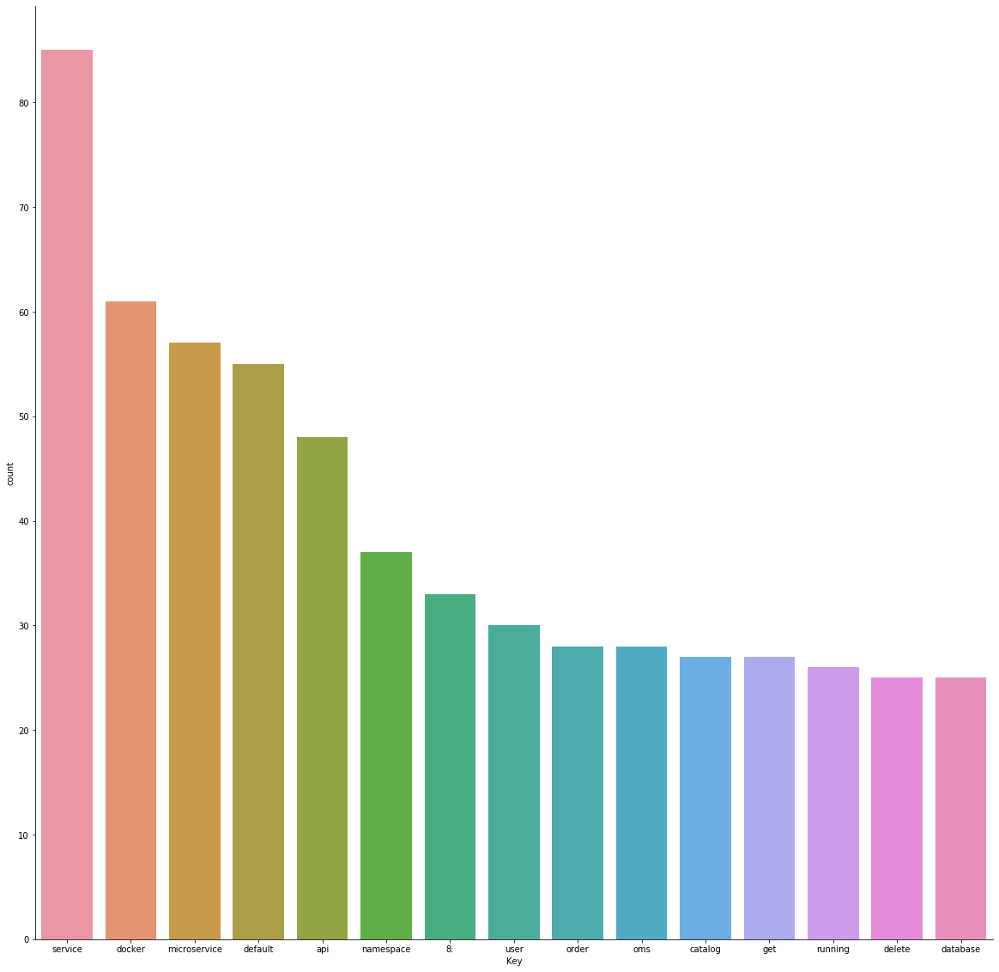

# Report for End of Year 1 Probation Review Meeting

This report describes the work that I have done since the last probation meeting that took place on the 25th of September 2019. It is structured as follows:

- A summary of the research problem
- Microservices classification proof of concept 
	- Results
	- Limitations
- Understanding microservice composition
- Challenges
- Next steps

## Summary of the research problem

The problem that I am trying to solve in my PhD research is the following:

*«How to automate, simplify and accelerate application development by way of the composing microservices?»*

Microservice is an architectural design style for building applications, which is gaining more and more popularity. Its adoption stems from the fact that it aligns with modern concepts in IT such as DevOps and Agile development whereby teams have less dependency with the ability to build, deploy, manage specific functionalities of an application. Because a microservices is a self-contained service, it helps provide freedom, agility and fast time to market that are also associated with the aforementioned modern concepts.

**Challenges**

Despite all the benefits that microservices provide, they also introduce new challenges. For instance, there is no real standard by which microservices need to adhere to. Similarly, several microservices that provide the same functionalities are being built which leads to duplicate efforts. The other challenge with microservices is that today it is still a complex task to build microservice-based applications which requires deep programming skills and manual task. It is the latter that this research is attempting to solve.

## Microservices classification: Proof of concept

In order to automate the composition of microservices to produce an application, one needs to have a way to map out functional requirements to existing microservices. For example if building an eCommerce application for a Retail business, mostly likley a cart and checkout microservices would be required, and as such both could be classified as retail type microservices. I tested two approaches for classifiying microservices by vertical functions: one approach that is based on a user defined dictionnary (which could be expanded into a library) and the other one is based on machine learning. For both approaches I have identified 11 classes including: Automotive, Banking, Education, Energy & Utility, Healthcare, Food and Beverages, Insurance, Law, Media & entertainment, Retail and Transportation.

- **User-defined dictionnary**

This approach consists in creating a dictionary containing most commonly used keywords for each industry. For example: Bank account, credit card, loans for banking. The next step consists in extracting text contents from the source files of the microservices based application and saing it into a single file after doing some data cleaning using a python program and the final step is the actual classification by running the single file against the dictionnary and if keywords are found in the file, the microservice is classified accordingly. For this approach I have added an additional 6 horizontal classes including: Search, Upload, Authentication, Monitoring, logging and Other. This was done so as to allow for a dual classification by vertical as well as horizontal function.
   
Code extract for data cleaning:

	path = "/Users/gleschen/Downloads/test_raw_file.txt"
	file=open(path,'r')
	lines=file.readlines()
	cummulateString=''
	for line in lines:
	#print(newLine)
	    for char in line:
	# Exclude the non alphabitical data.
	        if(char.isalpha()):
	            cummulateString+=char
	        elif(char.isspace()):
	            cummulateString+=''
	        elif(char.isupper()):
	            char=char.lower()
	            cummulateString+=char
	        else:
	            cummulateString+=' '
	            cummulateString+=' '
	print(cummulateString)
	#file.close()
	cummulateString+=' '

Removing non meaningful words known as stopwords:

	import sys
	stop_words = set(stopwords.words('english')) 
	word_tokens = word_tokenize(cummulateString)  
	filtered_sentence = [w for w in word_tokens if not w in stop_words]  
	filtered_sentence = [] 
	for w in word_tokens: 
	    if w not in stop_words: 
	        filtered_sentence.append(w) 
	print(word_tokens) 
	print(filtered_sentence) 
	with open('cleaned_data.txt', 'w') as f:
	    print(filtered_sentence, file=f)  
	file.close()

Code extract for the classification:

	import ast
	countDic ={}
	countDic['Topic']={}
	countDic['Topic']['H']={}
	countDic['Topic']['V']={}
	type_1='V'
	from keras.preprocessing.text import Tokenizer,text_to_word_sequence
	with open('/Users/gleschen/Downloads/_huge_Java-Bank-Project') as f:
	    cleanedData=f.read()
	    for indxCol in range(0,len(df.columns)):
	        if(indxCol < 13):
	            #print(df.columns[indxCol])
	            countDic['Topic'][type_1][df.columns[indxCol]]=0
	        else:
	            type_1='H'
	            countDic['Topic'][type_1][df.columns[indxCol]]=0
	        for indx in range(0,len(df.loc[:,df.columns[indxCol]])): 
	          #print(df.loc[:,df.columns[indxCol]][indx])
	          if df.loc[:,df.columns[indxCol]][indx] in cleanedData and df.loc[:,df.columns[indxCol]][indx]!='no':
	            countDic['Topic'][type_1][df.columns[indxCol]]+=1
	            #print(countDic['Topic'][type_1][df.columns[indxCol]])
	            print(df.loc[:,df.columns[indxCol]][indx])
	            cleanedatalist = ast.literal_eval(cleanedData)
	            t=Tokenizer()
	            t.fit_on_texts(cleanedatalist)
	HList=[]
	VList=[]
	for key in countDic['Topic']['H']:
	  if(countDic['Topic']['H'][key]==max(countDic['Topic']['H'].values())):
	    HList+=[key]
	for key in countDic['Topic']['V']:
	  if(countDic['Topic']['V'][key]==max(countDic['Topic']['V'].values())): 
	    VList+=[key]

The full code can be found in the following GitHub repository:

[Microservice classification based on user-defined dictionary](https://github.com/glmess/uol/blob/master/Microservices_Classification_Without_ML.ipynb)

- **Machine Learning based classification**

For this approach I used a combination of each of the 11 classes keywords and the string microservice to search for relevant repositories to for my training and testing dataset. I was able to scrape a total number of 1917 microservices repositories from Github. Just like in the other approach I first extracted the text from all the files of each repository and then converted it to a single in a process known as stemming and lematization using the natural language toolkit library and then tokenized and encoded the resulting contents. The code extract for this process is shown below:

	#Tokenize ,stemming, lemmatize
	stem=PorterStemmer()
	stemmingWordsLs=[]
	Lemmatizer = WordNetLemmatizer()
	stemmer = SnowballStemmer("english")
	lemmatizWordsLs=[]
	reposContentsTokenList = []
	reposContentsStrList=[]
	# Remove Duplications and stemmer
	for indx in range(0,len(reposContentsList)):
	        reposContentsTokenList += [list(dict.fromkeys(reposContentsList[indx].split(' ')))]
	        #print(list(dict.fromkeys(reposContentsList[indx].split(' '))))
	        reposContentsStrList.append('')
	        wordsLs=reposContentsTokenList[-1]
	        #print(wordsLs)
	        for wordIndx in range(0,len(wordsLs)):
	            if wordsLs[wordIndx] not in gensim.parsing.preprocessing.STOPWORDS and len(wordsLs[wordIndx]) > 3: 
	                    lemmatizWord=Lemmatizer.lemmatize(wordsLs[wordIndx])
	                    stemmingWordsLs+=[stemmer.stem(lemmatizWord)]
	                    reposContentsStrList[-1]+=stemmingWordsLs[-1]
	                    if(wordIndx !=len(wordsLs)-1):
	                        reposContentsStrList[-1]+=' '
	          
	        print(wordIndx)
	        reposContentsTokenList[-1]= stemmingWordsLs
	        stemmingWordsLs=[]
	        lemmatizWordsLs=[]
	vectorizer = TfidfVectorizer(analyzer='word',stop_words='english')
	X_encoded = vectorizer.fit_transform(cleanedData)
	
I then split the dataset in two: 80 per cent for training and 20 per cent for testing using the following code extract:

	xTrain,xTest,yTrain,yTest,repoNaTrain,repoNaTest=train_test_split(X_encoded,Y_encoded,reposNameList,test_size=0.2)

I trained the dataset using the following algorithms:

- Support Vector Machine
- Random Forest
- Multilayer perceptron
- XGBoost
- Naive Bayes
- Logistic regression
- Bagging 

The best accuracy I could achieve with my initial dataset was with Bagging classifier algorithm with 61% for testing and 84% for testing with quite a big gap between the two indicating an over fitting problem. I increased my dataset to 3899 microservices repositories and was able to increase the accuracy to 95% for training and 85% for testing. And while the accuracy improved the overfitting issue remains. I have recently downloaded more data which I'm currently cleaning and hope to run through the model in the coming and hopefully solve the overfitting issue.

[ML based microservice classification source code](https://github.com/glmess/uol/blob/master/Microservices%20Classification%20ML%20based.ipynb)

## Limitations

The non machine learning approach relies on the quality of the dictionnary which needs apart from relying on te keywords fed to it by its owner, it also needs to be maintained manually. As such it may not be accurate. 
Equally, for both approaches, the corpus used contains too much noise which may be difficult to get rid of completely and it relying on text extracted from source code. The quality of the corpus depends on a very descriptive documentation about the application which is not always done by developers especially for open source applications.

## Understanding Microservices composition.

**Amazon Web Services approach using Serverless Application Repository (SAR)and Serverless Application Model (SAM)**

AWS approach to microservices composition leverages two AWS main components which are AWS Serverless Application Model (SAM) and AWS Serverless Application Repository. 

AWS SAM
AWS defines SAM as: 

*"An open-source framework for building serverless applications. It provides shorthand syntax to express functions, APIs, databases, and event source mappings. With just a few lines per resource, you can define the application you want and model it using YAML. During deployment, SAM transforms and expands the SAM syntax into AWS CloudFormation syntax, enabling you to build serverless applications faster."*

AWS SAM and AWS Cloudformation an AWS implementation of the concept of infrastructure as code, which basically consists in defining resources to be deployed in an AWS account using a well defined syntax inside a template using YAML or JSON format.

Example of SAM template definition:

	AWSTemplateFormatVersion: '2010-09-09'
	Transform: 'AWS::Serverless-2016-10-31'
	Description: 'Sample SAM Template for serverless app'
	Globals:
  		Function:
    		Timeout: 3
	Resources:
	  MylambdaFunction:
    # Define resource as Lambda function.
    	Type: 'AWS::Serverless::Function'
    
    	Properties: 
      		# Set Nodejs v8.10 as lambda function runtime.
      		Runtime: nodejs8.10
        
      		# Defines Lambda function's handler.
      		Handler: index.handler
      
      		# Lambda function code location
      		CodeUri: ./src
      
      # Event sources to attach to this function. In this case, we are attaching
      # one API Gateway endpoint to the Lambda function. The function is
      # called when a HTTP request is made to the API Gateway endpoint.
      Events:
      
      # Define an API Gateway endpoint that responds to HTTP GET at /resource
      		MyApi:
 				Type: Api
				Properties:
                	Path: /resource
                	Method: GET
  		MyApp1:
    		Type: AWS::Serverless::Application
    		Properties:
      			Location:
        			ApplicationId: 'arn:aws:serverlessrepo:us-east-1:012345678901:applications/my-application'
        			SemanticVersion: 1.0.0
      			Parameters:
        			StringParameter: parameter-value
        			IntegerParameter: 2
  		MyApp2:
    		Type: AWS::Serverless::Application
    		Properties:
      			Location: <url_to_sam_template_on_s3_bucket>
	Outputs:
  		MyNestedAppOutput:
    		Value: !GetAtt MyApp1.Outputs.ApplicationOutputName
    		Description: Example nested app output

AWS Serverless Application Repository (SAR)

The AWS Serverless Application Repository is a managed repository for serverless applications. It enables teams, organizations, and individual developers to store and share reusable applications, and easily assemble and deploy serverless architectures in powerful new ways. Using the Serverless Application Repository, you don't need to clone, build, package, or publish source code to AWS before deploying it. Instead, you can use pre-built applications from the Serverless Application Repository in your serverless architectures, helping you and your teams reduce duplicated work, ensure organizational best practices, and get to market faster.

#AWS microservices composition example 1

The first example that we look at is a sample HelloWorld application implements a simple API backend. The resources to be deployed are an API Gateway endpoint and a Lambda function. The app performs a very basic functionality which is to service When a user's GET request sent to the API Gateway endpoint, which then triggers the invokation of the lambda function that returns a hello world message.

<https://docs.aws.amazon.com/serverless-application-model/latest/developerguide/serverless-getting-started-hello-world.html>

The SAM template to deploy the needed resources will look like this:

	AWSTemplateFormatVersion: '2010-09-09'
	Transform: 'AWS::Serverless-2016-10-31'
	Description: 'sam-app Sample SAM Template for sam-app'
	Globals:
  	Function:
    	Timeout: 3
	  	HelloWorldFunction:
  		Description: Hello World Lambda Function ARN
    	Value:
    		Fn::GetAtt:
      		- HelloWorldFunction
      		- Arn
	HelloWorldFunctionIamRole:
		Description: Implicit IAM Role created for Hello World function
		Value:
			Fn::GetAtt:
      		- HelloWorldFunctionRole
      		- Arn
	Resources:
  		HelloWorldFunction:
    		Properties:
      			CodeUri: HelloWorldFunction
				Events:
					HelloWorld:
          			Properties:
            				Method: get
            				Path: /hello
          			Type: Api
      			Handler: app.lambda_handler
      			Runtime: python2.7
    		Type: AWS::Serverless::Function
    	#nested application	
  		lambdaauthorizerbasicauth:
    		Type: AWS::Serverless::Application
    		Properties:
      			Location:
        			ApplicationId: arn:aws:serverlessrepo:us-east-1:560348900601:applications/lambda-authorizer-basic-auth
        			SemanticVersion: 0.2.0       
  		MyApi:
    		Type: AWS::Serverless::Api
    		Properties:
      			StageName: Prod      
      			Auth:
        			DefaultAuthorizer: MyLambdaRequestAuthorizer
        			Authorizers:
          			MyLambdaRequestAuthorizer:
            				FunctionPayloadType: REQUEST
            				FunctionArn: !GetAtt lambdaauthorizerbasicauth.Outputs.LambdaAuthorizerBasicAuthFunction
            				Identity:
              				Headers:
                				- Authorization
		HelloWorld:
    		Type: Api
    		Properties:
      			Method: get
      			Path: /hello
      			RestApiId: !Ref MyApi
      			Auth:
        			Authorizers: MyLambdaRequestAuthorizer
	Outputs:
	  HelloWorldApi:
	    Description: API Gateway endpoint URL for Prod stage for Hello World function
	    Value:
	      Fn::Sub: https://${MyApi}.execute-api.${AWS::Region}.amazonaws.com/Prod/hello/

In the above template, the microservice lambda-authorizer-basic-auth has been found from the AWS SAR as a microservice that fits the requirements for securing our helloWorld app API. The block code for the microservice is copied as SAM template from SAR and added as nested block into my template to provide the added functionality.  

	lambdaauthorizerbasicauth:
			# Type AWS::Serverless::Application defines a nested application
    		Type: AWS::Serverless::Application
    		Properties:
      			Location:
        			ApplicationId: arn:aws:serverlessrepo:us-east-1:560348900601:applications/lambda-authorizer-basic-auth
        			SemanticVersion: 0.2.0       

To deploy this template into my AWS account I need to run the following commands from my local machine where I already installed AWS sam cli:

	#Package the application
	sam package --template-file template.yaml --output-template packaged-output.yaml --s3-bucket <my-s3-bucketname>

	#Deploy the application
	sam deploy --template-file packaged.yaml --<AWS region> --stack-name TestApp --capabilities CAPABILITY_IAM CAPABILITY_AUTO_EXPAND

If I test the HelloWorld API as a standalone application without the authorizer in my local machine it works.

	(base) 186590dda78b:sam-app gleschen$ sam local invoke --no-event
	2019-11-18 18:06:13 Found credentials in shared credentials file: ~/.aws/credentials
	2019-11-18 18:06:13 Invoking app.lambda_handler (python2.7)

	Fetching lambci/lambda:python2.7 Docker container image.......................................
	2019-11-18 18:06:19 Mounting /Users/gleschen/sam-app/.aws-sam/build/HelloWorldFunction as /var/task:ro inside runtime container
	START RequestId: f4aeebb9-76bd-1e40-10c6-75674cd5244e Version: $LATEST
	END RequestId: f4aeebb9-76bd-1e40-10c6-75674cd5244e
	REPORT RequestId: f4aeebb9-76bd-1e40-10c6-75674cd5244e	Init Duration: 27.35 ms	Duration: 16.51 ms	Billed Duration: 100 ms	Memory Size: 128 MB	Max Memory Used: 21 MB	

	{"body":"{\"message\": \"hello world\"}","statusCode":200}
	(base) 186590dda78b:sam-app gleschen$ 

However if I test the composed app deployed in my AWS account, I would need to have the correct credentials otherwise I get an authorized error as shown below:
		
	#Testing without credentials
	(base) 186590dda78b:sam-app gleschen$ curl https://e4aqvihhw0.execute-api.eu-west-1.amazonaws.com/Prod/hello/
	{"message":"Unauthorized"}

	#Testing with correct credentials	
	(base) 186590dda78b:sam-app gleschen$ curl -u testuser:1234 https://e4aqvihhw0.execute-api.eu-west-1.amazonaws.com/Prod/hello/
	{"message": "hello world"}
	
#AWS microservices composition example 2

Twitter search app tha connect a twitter api to search for tweets and then invoke a lambda function to performs processing on the retrieved tweets.

SAM template

	AWSTemplateFormatVersion: '2010-09-09'
	Transform: 'AWS::Serverless-2016-10-31'
	
	Parameters:
	  LogLevel:
	    Type: String
	    Description: Log level for lambda function logging
	    Default: INFO
	Resources:
	  TweetProcessor:
	    Type: AWS::Serverless::Function
	    Properties:
	      CodeUri: .
	      Handler: mylambdafunction.handler
	      Runtime: python3.7
	      Timeout: 60
	      Environment: 
	        Variables: 
	          LOG_LEVEL: !Ref LogLevel
	  TweetEventSource:
	    Type: AWS::Serverless::Application
	    Properties:
	      Location:
	        ApplicationId: arn:aws:serverlessrepo:us-east-1:771389557967:applications/TweetEventSource
	        SemanticVersion: 0.0.2
	      Parameters: 
	        ProcessorFunctionName: !Ref TweetProcessor
	        # Search query to be passed to Twitter to select tweets to use for the event source.
	        SearchQuery: '#microservice -filter:nativeretweets'  

The TweetEventSource published in the SAR <https://serverlessrepo.aws.amazon.com/applications/arn:aws:serverlessrepo:us-east-1:771389557967:applications~TweetEventSource> application provides a functionality that is needed to augment the capability of the tweetProcessor application, so I am using the same process (nested stack inside SAM template) as before compose the two applications into a single app.

#AWS microservices composition example 3

The third example is a simple ecommerce application that enables customers to select a product and pay for it. The payment functionality is provided by a microservice published on the AWS SAR (<https://serverlessrepo.aws.amazon.com/applications/arn:aws:serverlessrepo:us-east-1:375983427419:applications~api-lambda-stripe-charge>), which can be copied and embedded onto the SAM template of the frontend microservice.

SAM template:

	AWSTemplateFormatVersion: '2010-09-09'
	Transform: AWS::Serverless-2016-10-31
	Description: simple ecommerce service
	Globals:
	  Function:
	    Timeout: 3
	Resources:
	  ShowProduct:
	    Type: AWS::Serverless::Function
	    Properties:
	      Handler: index.handler
	      Runtime: nodejs8.10
	      Timeout: 10
	      Events:
	        Api:
	          Type: Api
	          Properties:
	            Path: /product/{productId}
	            Method: GET
	      CodeUri: s3://my-appcomposition-bucket/84da25814ed6d6f674f263c7892fc396
	  apilambdastripecharge:
	    Type: AWS::Serverless::Application
	    Properties:
	      Location:
	        ApplicationId: arn:aws:serverlessrepo:us-east-1:375983427419:applications/api-lambda-stripe-charge
	        SemanticVersion: 3.0.0
	      Parameters:
	        CorsOrigin: '*'
	Outputs:
	  ApiUrl:
	    Value:
	      Fn::Sub: https://${ServerlessRestApi}.execute-api.${AWS::Region}.amazonaws.com/Stage/product/123
	    Description: The URL of the sample API Gateway

#AWS microservices composition example 4 

This example is a basic http microservice endpoint that performs read/write to DynamoDB with a RESTful API endpoint using Amazon API Gateway. The composition is done with another microservice that takes the data written to the table as input to make another http request to the API gateway endpoint.

SAM template:

	AWSTemplateFormatVersion: '2010-09-09'
	Transform: 'AWS::Serverless-2016-10-31'
	Resources:
	  BasicLogTable:
	    Type: AWS::Serverless::SimpleTable
	    Properties:
	        SSESpecification:
	          SSEEnabled: true
	        TableName: basic-log-table
	        PrimaryKey:
	          Type: String
	          Name: username
	  Microservicehttpendpoint1:
	    Type: AWS::Serverless::Application
	    Properties:
	      Location:
	        ApplicationId: arn:aws:serverlessrepo:us-east-1:077246666028:applications/microservice-http-endpoint
	        SemanticVersion: 1.0.3
	      Parameters: 
	        TableNameParameter: !Ref BasicLogTable  
	  Microservicehttpendpoint2:
	    Type: AWS::Serverless::Application
	    Properties:
	      Location:
	        ApplicationId: arn:aws:serverlessrepo:us-east-1:077246666028:applications/microservice-http-endpoint
	        SemanticVersion: 1.0.3
	      Parameters: 
	        TableNameParameter: !Ref BasicLogTable  
            
#AWS microservices composition example 5 - WSO2 with Ballerina 

A Travel agency that manages tours for tourists needs to issue and airline ticket reservation, book a hotel room and car rental. The hotel, airline and car rental services are all external services to the travel agency service as illustrated in the following diagram:

Details of the composition approach are described in the following github repository readme file:
<https://github.com/ballerina-guides/service-composition>

#AWS microservices composition example 6 - Medley domain specific language (DSL)

The Medley DSL allows users to declare and configure processes to use and to compose. In particular, the Medley DSL enables users to express how to compose processes altogether according to the events that can occur on their respective output streams. 

The code extract below gives an overview of a composition of a set of processes. 

The code block below describes a composition that periodically (line 2, 13) checks for new high-priority issues created on a specific GitHub 2 repository. If a new issue is detected, it notifies the user by sending her an email containing the issue’s URL.The email service is selected from a pool of interchangeable services, enabling fault-tolerance on service unavailability. It also notifies the user if an error is encountered with the GitHub service when polling for new issues. Furthermore,this example enables us to highlight some key language operators of the Medley DSL, and concepts of the Medleyplatform. (E. Ben Hadj Yahia et al., 2016)

	 composition {
	2 	process tick = require("Medley/Tick");
	3 	process getNewIssues = require("Github/GetNewIssues");
	4 	getNewIssues.init({"credentials": "<label>"});
	5 	process gmail = require("Gmail/SendEmail");
	6 	process outlook = require("Outlook/SendEmail");
	7 	// ...
	8 	pool process sendEmail = require("Medley/Pool");
	9 	sendEmail.add(gmail, outlook);
	10 	sendEmail.init({"strategy": "round-robin"});
	11 	on (tick:out) do {
	12 		stream issues = getNewIssues.invoke({
	13 			"repository": "medley/repo"
	14 		});
	15 		on (issues:out as issue) do {
	16 			if ({{$.issue.priority}} == "high") {
	17 				sendEmail.invoke({
	18 					"to": "john@doe.com",
	19 					"body": "New issue: {{$.issue.url}}"
	20 				});
	21 			} }
	22 			on (issues:err as error) do {
	23 			 sendEmail.invoke({
	24 				"to": "john@doe.com",
	25 				"body": "Error encountered while fetching new issues: {{$.error.message}}"
	26 			});
	27 } } }
#More examples

##Tweet sentiment Analysis
This application is composed with the twitter event source app to processes tweets for a given Twitter search, calls Amazon Comprehend to do sentiment analysis on the tweet text, and publishes the sentiment scores as custom metrics to Amazon CloudWatch Metrics.

Architecture

SAM template: <https://github.com/jlhood/tweet-sentiment-python/blob/master/template.yml>

Full details and installation guide available in the following GitHub repo:
<https://github.com/jlhood/tweet-sentiment-python>

##eCommerce example:

Architecture:

Deployment instructions:

<https://github.com/aws-samples/aws-serverless-event-fork-pipelines/blob/master/examples/ecommerce-app/checkout-api/README.md>

##Real world serverless example

Architecture:

Deployment instructions:

<https://github.com/awslabs/realworld-serverless-application>

#Common patterns 
- Events

- API

- Middleware (Queue system, notification service, integration adapter)

# Commonalities of Microservice-based applications
To try understand how microservices combined manually together into an application. The goal of this exercise is to identify common patterns and commonly used components in the process of building microservice-based applications in order to automate and simplify the process.

## Methodology

I worked on a sample of 100 open source applications that were found mainly from GitHub. I then saved the urls into a csv file which I used as input file to a python program that search for images in the GitHub repos of the 100 apps, extract texts from the found images using google vision api and produce a data visualization bar chart that shows the texts that are used the most from the found images.

## Search criteria

I used the following keywords:

"Microservice AND application" OR
"Microservice AND architecture"

I ultimately selected applications that met the above criteria AND in additon had an architecture diagram.

## URLs crawling

I uploaded the csv (microservice_based_apps.csv) file containing the urls of my sampe of 100 applications into my Gdrive which I then mounted into my python program which I run on Jupyter notebook of Google Colaboratory. 
I used pandas and Beautifulsoup libraries to read the URLs from the csv file and retrieve the images. See code snippet below:

	repo_links = pd.read_csv('microservice_based_apps.csv')
	images = []
	#print(repo_links['source'].dtypes)
	for link in repo_links['source']:
	    print(link)
	    html_page = urllib2.urlopen(link)
	    soup = BeautifulSoup(html_page)
	    images.append([])
	    for img in soup.findAll('img'):
	        #print(img)
	        images[-1].append(img.get('src'))
	        
	print(images)

## Reading texts from images

Once the images have been collected, the next step was to read texts from those images. This was done using the following code:

	# getting length of list 
	length = len(images) 
	#print(length)
	#print(len(images[0]))
	textls=[]
	listOfAnno=[]
	# Iterating the index 
	# same as 'for i in range(len(list))' 
	for i in range(length):
	    textls.append([])
	    print(i)
	    for j in range(len(images[i])):
	        #img = cv2.imread('images[i]')
	        if(images[i][j].split('/')[-1]==''):
	            continue
	        if(images[i][j].split('/')[0] != 'https:'):
	            images[i][j]='https://github.com'+images[i][j]
	    
	        #file=open([i].split('/')[-1]images,'wb')
	        #print(j)
	        try:
	            file=open(images[i][j].split('/')[-1],'wb')
	        except:
	            continue 
	        file.write(requests.get(images[i][j]).content)
	        with open(images[i][j].split('/')[-1], 'rb') as image_file:
	            content = image_file.read()
	            
	        image = types.Image(content=content) 
	        client = vision.ImageAnnotatorClient()
	        
	        #print(client)
	        try:
	            response = client.text_detection(image=image)
	            #print(response)
	        except:
	            continue
	        text = response.text_annotations
	        
	        #print(type(list(text)))
	        if(list(text)== []):
	            continue      
	        text = list(text[0].description)
	        if(text==[]):
	            continue
	        textls[-1].append(text)    
	        annoString =''
	        #listOfAnno.append([])
	        for ch in text:
	            if ch =='_' or '': 
	                 annoString+=ch
	            elif ch == ' ' :
	                 annoString+=' '
	            elif ch == '\n':
	                listOfAnno.append(annoString)
	                annoString= ''
	            else:
	                annoString+=ch
      

## Data visualization

The final stage was to plot the texts extracted from the images onto a bar chart with the text in x axis and their corresponding number of occurences (word count) in the y axis. I used the following code snippet:

	
	fig,ax=plt.subplots()
	fig.set_size_inches(20,20)
	sns.barplot(x=wordsCount['Key'][:15],y=wordsCount['count'][:15],ax=ax)
	sns.despine()

I only chose to display the first 15 texts which are shown in teh following diagram:

The full source code is available on the following Github repository:

[Microservice Architecture diagram mining source code](https://github.com/glmess/uol/blob/master/microsrvc_based_apps_mining_with_chart.ipynb)

## Conclusion

Service is the text that has to highest number of ocurrence with a total of 86 occurrences followed by docker which occurences over 60 times and microservice, default and api. Out of the 15 texts however, only 6 of them (listed below) truly represent an architecture components. We can therefore conclude on the basis of the results of the study that these 5 components are highly likely to be part of a microservice-based application.

- Service
- Docker
- Microservice
- API
- Get
- Database

## Limitations
The methodology used could be improved for it has a number of limitations including the fact that the program did not triage images to only include the ones for the architecture diagrams. As results the data had lots of noise. For instance the diagram shows that the number 8 was capture over 30 times as a text from images and such text does not tell us much about the architecture of microservice-based applications. The same goes for other texts such as delete, namespace, catalog and more.

One way to remove (or at least reduce the noisy data) would be to get the URLs of images directly rather that the entire github repo for each application which has lots of non-relevant images.

## Manual mining

In order to address the aforementioned limitatiions related to mining the architecture components, I went through each GitHub repo and looked the architecture diagram of each application and I was able to identify the most common components grouped in 9 mains categories including:

- Infrastructure
- API Gateway
- Web layer 
- Event bus/Message broker
- Programming languages
- Communication protocols
- Service registry/Discovery
- Frameworks

From **infrastructure** perspective containerization is the most used approach for running microservice-based application with Docker and Docker-compose being the most used. Kubernetes is used to provide management and orchestration. Other flavour such as Openshift are also used but to a lesser extend. Once containerized these applications are run on hyperscale cloud platform such as AWS or Azure (the 2 most popular) and IBM Bluemix for one or two cases.

Almost every application in the sample was designed with an **API Gateway**. Few of the architecture mentioned explicitly which type were used but Zuul API gateway was mentioned 3 times.

The technologies used as **web Layer** were pretty mixed with common web servers such as Apache, tomcat, nginx being used.

The most commonly **message broker** across the 100 applications is RabbitMQ.

In terms of the **communication protocols** the most popular are HTTP RESTful and gRPC. AMQP was mentioned a couple of times as the choice for message queuing communication.

The most widely used **service registry and discovery** is Eureka which basically allows services to registered and be discoverable when they come online so that request can be directed to microservices according to the service they advertise.

In terms of the **framework** spring boot and .NET core were the most popular.

**Programming** languages were pretty mixed with microservices components being written Java, Nodejs, Go, python to name but a few. Similarly, in terms of **databases** flavours all kind of engines were used and were either relational or NoSQL depending on the type of workload.

#References

1. Yahia, E. B. H., Réveillère, L., Bromberg, Y.-D., Chevalier, R., & Cadot, A. (2016). Medley: An Event-Driven Lightweight Platform for Service Composition. Lecture Notes in Computer Science Web Engineering, 3–20. doi: 10.1007/978-3-319-38791-8_1

2. <https://docs.aws.amazon.com/serverless-application-model/latest/developerguide/serverless-sam-template.html>

3. <https://github.com/ballerina-guides/service-composition>

4. <https://serverlessrepo.aws.amazon.com/applications/arn:aws:serverlessrepo:us-east-1:375983427419:applications~api-lambda-stripe-charge>

5. <https://docs.aws.amazon.com/serverless-application-model/latest/developerguide/serverless-getting-started-hello-world.html>

6. <https://aws.amazon.com/serverless/sam/>
7. <https://aws.amazon.com/serverless/serverlessrepo/>