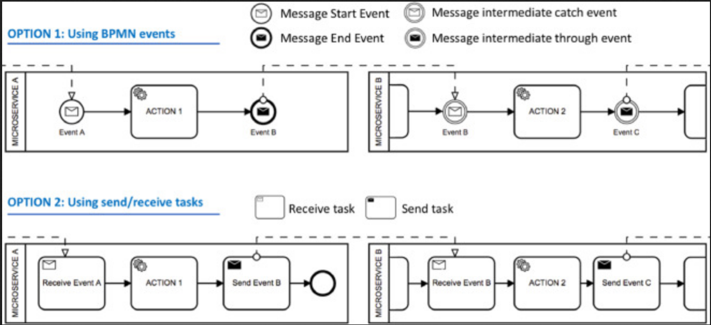
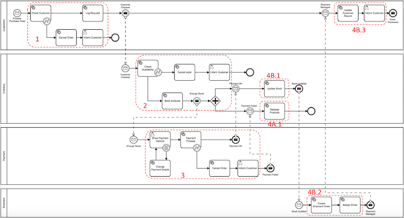
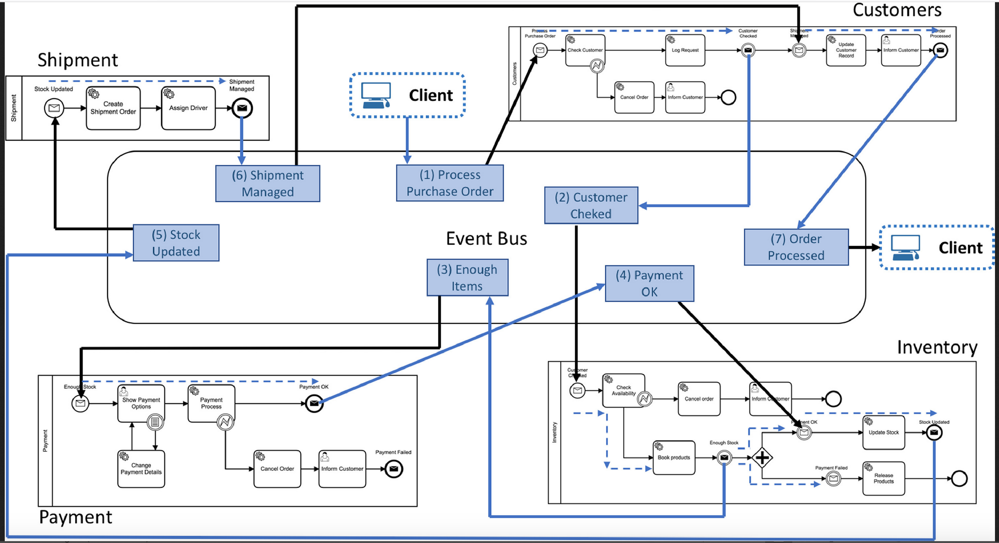
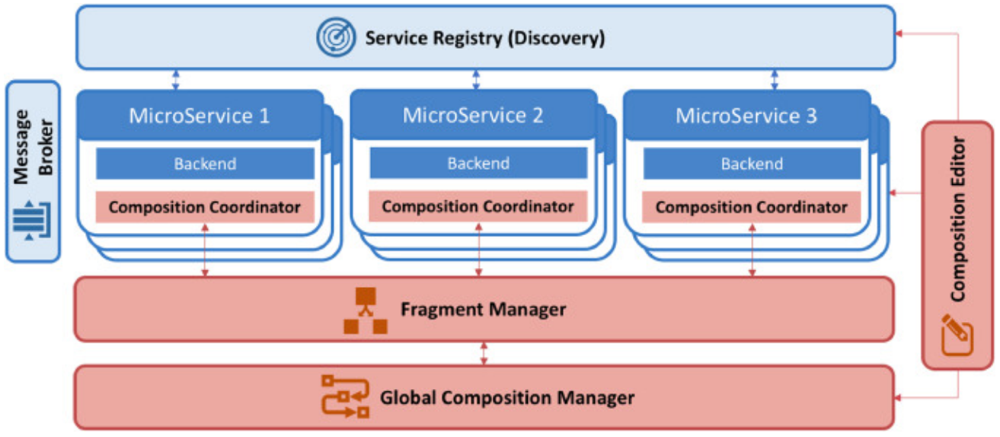
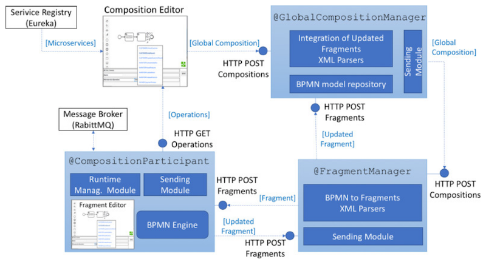

# Summary of papers review 
This document summarizes my findings following the review of selected studies that discuss on microservices composition or microservices patterns. The aim of this review is to i) have a solid understanding of the field related to my research namely microservice composition ii) come up with research questions that are relevant to the my research.

## Papers selection process

The papers in scope were retrieved by running the following query on ScienceDirect database: 

*"microservice composition" OR "microservice pattern"*

The queries returned 14 results. I then reviewed the abstracts of each the the 14 papers and excluded the ones that did not contain the target keywords in abstract as well as the ones that focus on composition nor patterns of microservices. From this exercise I identify 3 relevant papers and 3 more that were cited in those papers.

##Findings
P. Valderas et al. (2020) discuss a microservice composition approach which is based on the choreography of Business Process Model and Notation (BPMN) fragments. The BPMN is an Object Management Group (OMG) standard which allows for a graphical representation (modeling) of business processes. The researchers discuss a new approach to composing microservices based on an event-based choreography of BPMN fragments. This is a three-steps process:

1. Creation of the BPMN model which describes the big picture of the composition process
2. Split the model into BPMN fragments which are subsequently distributed among microservices. This process uses a 11-setp algorithm which can be found in appendix of this document
3. Execution of the BPMN fragments through an event-based choreography.

This approach aims to providing developers with a solution that allows having a centralized model which describes the big picture of a microservice composition while having at the same time the possibility to execute the composition defined in this model by way of event-based choreography. 

This approach has the advantage that it combines an orchestration-based solution which is usually considered BPMN as remark P. Valderas et al. (2020) and the choreography solution which helps achive the decoupling and independence promise of microservice architecture. Another significant advantage that this approach presents is that it makes easy for developers to implement changes in the participant microservices in the composition following a change in business requirements which would then require the big picture to be updated. The researchers propose a 3-step algorithm for updating a BPMN model following a change in a participating microservice. Details of this algorithm can be found in appendix.

P. Valderas et al. (2020) approach supports microservice choreographies that use pub/sub mechanisms to establish collaboration. A microservice is triggered by an event to accomplish its task and once complete, an event is produced, which triggers other microservices waiting for this event to execute their tasks. 

Fig.1 Event-based communication among microservices in BPMN 2.

They illustrate their approach using an an example of an ecommerce scenario that describes an order processing in an online store. This process is supported by four microservices: Customers, Payment, Inventory, and Shipment. The sequence of steps that these microservices must perform when a customer places an order in the online shop are outlined in appendix.

Fig.2 Microservice composition for the place order process example

Once the BPMN fragments of a microservice composition have been obtained, each of them must be deployed into the microservice that is responsible for executing it. An event-based choreography of BPMN fragments can be achieved as it is illustrated in Fig. 3. below, each microservice is in charge of executing its corresponding process fragment and informing the others about it.  Once the client places an order in the online store, the client application triggers the event “Process Purchase Order”. The Customers microservice, which is listening to this event (defined through the start event of its pool), reacts executing part of its associated BPMN fragment and pauses its execution to trigger the event “Customer Checked” (see the message intermediate through event). Then, the Inventory microservice, which is listening to this event, executes its BPMN fragment and generates the event that makes the next microservice in the composition to execute the next process fragment. And so on. When the Shipment microservice generates the event “Shipment Managed”, the Customer microservice resumes its tasks and finishes the composition by triggering the event “Order Processed”.

Fig.3 Event-based Microservice Choreography of BPMN fragments

The solution uses an event bus through which microservices communicate asynchronously which effectively helps achieve the decoupling and independence in the architecture. The authors mention some examples of message brokers such as RabbitMQ, Kafka, Fuse which can be used to implement the event bus technology. As for BPMN engines required to execute the BPMN fragments by each participating microservice in the composition process, they provide the following examples: Camunda, Activi, Bonita, Bizagi, jBM.

## Architecture
Fig. 4 depicts the architecture diagram of P. Valderas et al. (2020) approach and show the following main components:

- Service registry (discovery): whose role is to discover microservices 
- Composition coordinator: responsible for coordinating the execution of the BPMN fragment assigned to a participating microservice
- Fragment manager: responsible for splitting the global BPMN model into fragments and distributing them to corresponding composition coordinators
- Global composition manager: which describes and manages the entire composition process (big picture) and stores the BPMN model.
- Message broker: which enable microservices to communication with each other as the composition process takes place
- Composition editor which is used to create the BPMN model which is then sent and seved in the global composition manager.

Fig. 4 Architecture overview

## Implementation

To implement this microservice composition approach, Valderas et al. (2020) used the following tools (illustrated in the diagram shown in Fig.5 below):

- NetFlix Eureka as Service discovery microservice whici allows for the registrations of microservices and the access through http
- RabbitMQ message broker
- 3 Custom Java libraries were developed by the researchers using Sprint boot framework to serve the purpose of the fragment manager, the Global composition and composition coordinator microservices. These two libraries are made available to every developer who can include them in their sprint boot project by simply using these anotations: @GlobalCompositionManager, @FragmentManager and @CompositionCoordinator for global composition manager, fragment manager and composition coordinator respectively.
- A web based tool based on bpmn.io open source to implement the composition editor
- Camunda BPMN engine 

Fig.5 Realization of the proposed architecture

## Opportunity for further research
While Valderas et al. (2020) managed to demonstrate the efficiency fo their approach compared to ad hoc composition they acknowledge the fact that the approach currently does not account for any potential data interchange between microservice if required as part of the composition process. They reckon that it would enhance the approach it data interchange was clearly defined in the big picture and how this should be managed by the split fragments. 
Another opportunity where the research see a gap is the ability to keep track of existing composition and reuse them or expand on them to the execution of service tasks in the BPMN model. 

# Appendix

## Order processing process

1. Customers microservice checks the customer data and registers the request. If the customer data is not valid then the customer is informed and the process of the order is cancelled. On the contrary, if customer data is valid the control flow is transferred to the Inventory microservice.
2. The Inventory microservice checks the availability of the ordered items. If there is not enough stock to satisfy the order, the process of the order is cancelled and the customer is informed. On the contrary, the items are booked and the control flow of the process is transferred to the Payment microservice.
3. The Payment microservice provides the customer with different alternatives to proceed with the payment of the order as well as to change payment details. Next, the microservice processes the payment.

Depending on the result of the payment two different sequences of steps are performed.

If the payment fails:

- The Inventory microservices releases the booked items and the process of the order is cancelled.

If the payment is successful, the following three steps are performed:

- The Inventory microservices update the stock of the purchased items and the control flow is transferred to the Shipping microservice.

- The Shipping microservice creates a shipment order and assign it to a driver and the control flow is transferred to the Customer microservice.

- The Customer microservice updates the customer record and informs the customer about the finalization of the process.

## Algorithm for splitting BPMN model into fragments

INPUT: a BPMN model that represents a microservice composition

OUTPUT: a set of BPMN fragments

1. For each microservice pool in the BPMN model:
2. A new BPMN model is created;
3. The pool is copied in the new model;
4. A new black-box pool is created to represent an event bus;
5. For each message flow:
6. If the microservice pool is the source: connect the flow target to the event bus pool;
7. If the microservice pool is the target: connect the flow source to the event bus pool;
8. If the microservice pool has the start message event which starts the composition:
9. A new message flow is added between the event bus pool and the start message event;
10. If the microservice pool has the end message event which finishes the composition:
11. A new message flow is added between the end message event and the event bus pool;

## Algorithm for integrating BPMN fragment into the big model

INPUTS:

big picture: a BPMN model that represents a microservice composition
fragment: a BPMN model that includes a microservice pool together with an event-bus pool
 
OUTPUT: an updated BPMN model that represents a microservice composition

1. Get the microservice pool from the fragment
2. Find this microservice pool in the big picture
3. Replace the big picture's pool by the fragment's pool

## References
1. Pedro Valderas, Victoria Torres, Vicente Pelechano,
A microservice composition approach based on the choreography of BPMN fragments, Information and Software Technology, Volume 127, 2020

