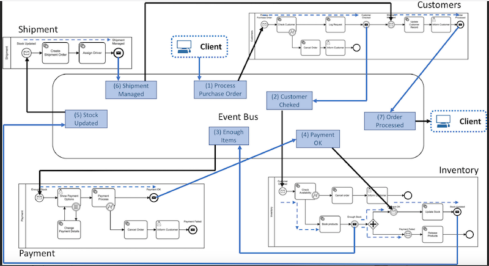

# Summary of papers review 
This document summarizes my findings following the review of selected studies that discuss on microservices composition or microservices patterns. The aim of this review is to i) have a solid understanding of the field related to my research namely microservice composition ii) come up with research questions that are relevant to the my research.

## Papers selection process

The papers in scope were retrieved by running the following query on ScienceDirect database: 

*"microservice composition" OR "microservice pattern"*

The queries returned 14 results. I then reviewed the abstracts of each the the 14 papers and excluded the ones that did not contain the target keywords in abstract as well as the ones that focus on composition nor patterns of microservices. From this exercise I identify 2 relevant papers and 4 more that were cited in those papers.

# Findings

## I. Microservices composition

### Method 1: A microservice composition approach based on the choreography of BPMN fragments

P. Valderas et al. (2020) discuss a microservice composition approach which is based on the choreography of Business Process Model and Notation (BPMN) fragments. The BPMN is an Object Management Group (OMG) standard which allows for a graphical representation (modeling) of business processes. The researchers discuss a new approach to composing microservices based on an event-based choreography of BPMN fragments. This is a three-steps process:

1. *Creation of the BPMN model which describes the big picture of the composition process*
2. *Split the model into BPMN fragments which are subsequently distributed among microservices. This process uses a 11-setp algorithm which can be found in appendix of this document*
3. *Execution of the BPMN fragments through an event-based choreography.*

This approach aims to providing developers with a solution that allows having a centralized model which describes the big picture of a microservice composition while having at the same time the possibility to execute the composition defined in this model by way of event-based choreography. 

This approach has the advantage that it combines an orchestration-based solution which is usually considered BPMN as remark P. Valderas et al. (2020) and the choreography solution which helps achive the decoupling and independence promise of microservice architecture. Another significant advantage that this approach presents is that it makes easy for developers to implement changes in the participant microservices in the composition following a change in business requirements which would then require the big picture to be updated. The researchers propose a 3-step algorithm for updating a BPMN model following a change in a participating microservice. Details of this algorithm can be found in appendix.

P. Valderas et al. (2020) approach supports microservice choreographies that use pub/sub mechanisms to establish collaboration. A microservice is triggered by an event to accomplish its task and once complete, an event is produced, which triggers other microservices waiting for this event to execute their tasks. 

Fig.1 Event-based communication among microservices in BPMN 2.

They illustrate their approach using an an example of an ecommerce scenario that describes an order processing in an online store. This process is supported by four microservices: Customers, Payment, Inventory, and Shipment. The sequence of steps that these microservices must perform when a customer places an order in the online shop are outlined in appendix.

Fig.2 Microservice composition for the place order process example

Once the BPMN fragments of a microservice composition have been obtained, each of them must be deployed into the microservice that is responsible for executing it. An event-based choreography of BPMN fragments can be achieved as it is illustrated in Fig. 3. below, each microservice is in charge of executing its corresponding process fragment and informing the others about it.  Once the client places an order in the online store, the client application triggers the event “Process Purchase Order”. The Customers microservice, which is listening to this event (defined through the start event of its pool), reacts executing part of its associated BPMN fragment and pauses its execution to trigger the event “Customer Checked” (see the message intermediate through event). Then, the Inventory microservice, which is listening to this event, executes its BPMN fragment and generates the event that makes the next microservice in the composition to execute the next process fragment. And so on. When the Shipment microservice generates the event “Shipment Managed”, the Customer microservice resumes its tasks and finishes the composition by triggering the event “Order Processed”.

Fig.3 Event-based Microservice Choreography of BPMN fragments

The solution uses an event bus through which microservices communicate asynchronously which effectively helps achieve the decoupling and independence in the architecture. The authors mention some examples of message brokers such as RabbitMQ, Kafka, Fuse which can be used to implement the event bus technology. As for BPMN engines required to execute the BPMN fragments by each participating microservice in the composition process, they provide the following examples: Camunda, Activi, Bonita, Bizagi, jBM.

### Architecture
Fig. 4 depicts the architecture diagram of P. Valderas et al. (2020) approach and show the following main components:

- Service registry (discovery): whose role is to discover microservices 
- Composition coordinator: responsible for coordinating the execution of the BPMN fragment assigned to a participating microservice
- Fragment manager: responsible for splitting the global BPMN model into fragments and distributing them to corresponding composition coordinators
- Global composition manager: which describes and manages the entire composition process (big picture) and stores the BPMN model.
- Message broker: which enable microservices to communication with each other as the composition process takes place
- Composition editor which is used to create the BPMN model which is then sent and seved in the global composition manager.

Fig. 4 Architecture overview

### Implementation

To implement this microservice composition approach, Valderas et al. (2020) used the following tools (illustrated in the diagram shown in Fig.5 below):

- NetFlix Eureka as Service discovery microservice whici allows for the registrations of microservices and the access through http
- RabbitMQ message broker
- 3 Custom Java libraries were developed by the researchers using Sprint boot framework to serve the purpose of the fragment manager, the Global composition and composition coordinator microservices. These two libraries are made available to every developer who can include them in their sprint boot project by simply using these anotations: @GlobalCompositionManager, @FragmentManager and @CompositionCoordinator for global composition manager, fragment manager and composition coordinator respectively.
- A web based tool based on bpmn.io open source to implement the composition editor
- Camunda BPMN engine 

Fig.5 Realization of the proposed architecture

### Opportunity for further research
While Valderas et al. (2020) managed to demonstrate the efficiency fo their approach compared to ad hoc composition they acknowledge the fact that the approach currently does not account for any potential data interchange between microservice if required as part of the composition process. They reckon that it would enhance the approach it data interchange was clearly defined in the big picture and how this should be managed by the split fragments. 
Another opportunity where the research see a gap is the ability to keep track of existing composition and reuse them or expand on them to the execution of service tasks in the BPMN model. 

### Method 2: Microflows: Lightweight Automated Planning and Enactment of Workflows Comprising Semantically-Annotated Microservices
Valderas et al. (2020) cite as related work the research done by Oberhauser (2016) on workflow orchestration of semantically-annotated microservices. Oberhauser (2016) outlines seven (five main and two optional) principles that guide his Microflows solutions:

1. **Semantic Self-description Principle**: which supports that microservices have sufficient semantic metadata for autonomous client invocation. This was implemented using JSON-LD and Hydra
2. **Client Agent Principle**: which supports the modeling and planning of the goal-oriented actions of microservices in the workflow. This was implemented using Jadex v. 3.0-SNAPSHOT BDI (Belief-Desire-Intention) agents
3. **Gaph of Microservices Principle**: which supports the mapping of microservices to nodes in a graph database which was implemented using Neo4j graph database
4. **Microflow as Graph Path Principle**: which support that a directed graph of nodes represent a workflow and its sequence of operations of microservices. This is determined using an algorithm such as SPF (Shortest Path First)
5. **Declarative Principle**: which supports the requirement spefication of the workflow as delcarative statement such as the starting microservice type or end microservice type and constraints such as sequencing constraints.
6. **Microservice Discovery Service Principle
(Optional)**: to support the registration and discovery of microservice implemented using NetFlix Eureka.
7. **Abstract Microservices Principle (Optional)**: which supports that microservices with similar functionality could be grouped behind an abstract microservice to receive client requests.

The Microflow lifecycle consists in four phases:

- *The Microservice Discovery stage*: in this stage a microservice discovery service builds a
graph of nodes containing the properties of the
microservices and links to other microservices. The researcher illustrates the interactions of this stage with the diagram below:

- *Microflow Planning stage*: an agent (PlanningAgent) takes the goal and other constraints, creates a plan or microflow. The agents find start and end node using algorithm such as SPF to find a directed path. Tha annotation below shows that anytime the input Pathparameters changes, the agent triggers a planning.

- *Microflow Enactment stage*: this is the execution stage of the microflow which happens by invoking each microservice in the order of the plan sequentially or in parallel. This is done by the ExecutionAgent which has three beliefs: pathWrapper, currentNode (points to which node is either active or about to be executed), and path (the planned microflow). The ExecutionAgent's plan is triggered by a change to the path variable (by the PlanningAgent), as shown in the annotation below:

Oberhauser (2016) uses the diagram below to illustrate the interactions that take place during the microflow enactment stage.

- *Microflow Analysis stage*: In this stage takes place the monitoring, analysis, and mining of execution logs for continual planning improvement

### Opportunity for further research
Oberhauser (2016) study demonstrate that microflows are lightweight compared to standard workflows implemented in a BPM suite such as AristaFlow BPM Suite. He acknowledges however, a gap in the approach due to a lack of verification and validation techniques, optimizing resource usage, integrating semantic support in the discovery service, transactional workflow support, support for gateways, supporting compensation and long-running processes, and enhancing the declarative and semantic support and capabilities all of which are areas that could be explored with a goal to enhancing the approach.

### Method 3: Medley: an event-driven lightweight platform for service composition
Yahia et al. (2016) introduce Medley, an event-driven lightweight platform for service composition. It uses a domain-specific language (DSL) for describing orchestration and a compiler that produces efficient code. Medley is designed to help solve challenges associated to low level service composition laguages such as BPEL that focus more on the technical implementation of the composition rather than on the bsuiness logic. 

In this approach the developer specifies two types of information via Medley DSL:

- How to assemble the services together
- The composition logic

Process workflows in the form of pattern of events are mapped to participating services and by providing the above mentioned set of information, the user tells Medley platform which process to invoke based when a specific event occurs. The Medley DSL is passed to the compiler which then generate code that can be deployed in containerized platform or resource constrained edge devices.

The snapshot below taken from Yahia et al. (2016) study shows an example of service composition declaration using Medley DSL

The example above describes a composition that polls a given GitHub repo to check for new high priority issues and upon encountering one or an error, it sends an email to a predefined user. 

The line of code 2 below is the process responsible to emitting tick events on a predefined frequency for the composition to poll the GitHub repo to look for new high priority issues.
 
	process tick = require("Medley/Tick") 
	
Medley framework has many advantages including the fact that it is lightweight and its support for data exchange between participating services. Yahia et al. (2016) in their study did a comparative evaluation with other frameworks including Bite, S and WS-BPEL. The selection of these 3 frameworks was based on the fact that they focus on web service composition and propose a language to describe the composition similar to Medley DSL. They looked at the following features in their evaluation: Dynamic typing, Dynamic service selection, Exception handling, Hybrid service support, language extensibility and scoping in terms of the ability to define and use nested blocks and localized variables. Out of the four frameworks, the results of their comparison show that only Medly fully supports the all the aforementioned features. No other framework supports dynamic service selection and only WS-BPEL partially supports hybrid service. 

### Opportunity for future research
One of the area where Yahia et al. (2016) see an opportunity to further their work is to look at a way of extending the language to specify when a change of a remote resource has to be reported as a new event in the case of polling. They mentioned they are already working on defining new algorithms to efficiently compute diffs of XML or JSON documents though I could not find any reference of such work. They also see an opportunity around data security by looking for ways to prevent composing from exposing sensitive data to unauthorized users.

### Method 4: Beethoven: An Event-Driven Lightweight Platform for Microservice Orchestration
Monteiro et al. (2018) propose a platform for microservice composition known as Beethoven that combines a reference architecture and a textual orchestration DSL known as Partitur which is built using Xtext, a tool based on the Eclipse Modeling Framework for the development of programming languages and DSL.

### Beethoven reference architecture
The platform is built on a 4-layer reference architecture as shown in the diagram below.

- **The API layer**: Interface endpoint for accessing the service layer

- **Service layer**: provides a controlled access point to the Database Abstraction and Orchestration layers and implements services that are consumed by the API layer. This layer can help build applications for managing, monitoring, and visualizing the workflow execution.

- **Database Abstraction Layer**: stores the workflow, task, and event handler definitions. It also records data for workflow instances execution (resource utilization, throughput, and execution time). 

- **Orchestration Engine Layer**: this is the layer that provides the workflow execution and is made odf 3 main components: Event Channel, Event Processor (Decider, Report, Workflow, and Task), and Instance Work (Task and Workflow). The Event Channel is used as an event bus to exchange messages among Event Processor components and can be implemented as message queues, message topics, or a combination of both. The Event Processor processes events and publish another event to the Event channel to notify success or failure. An Event Processor component can be bound to a set of Instance Worker components, which are responsible for performing a specific activity (e.g., decision, reporting, workflow, or task) demanded by the Event Processor component to which it is bound.

### Partitur - Beethoveen orchestration DSL

Partitur is a textual DSL for defining microservices orchestration in Beethoven built on Xtext which is an Eclipse Modeling Framework for the development of programming languages and DSLs. 

Partitur is made of 3 main elements:

- **Workflow**: an abstraction of a business process that is executed in a distributed manner among different microservices. A Partitur workflow is composed of: (i) a unique identifier that represents the workflow name; (ii) a set of tasks that represent each business task or activity that is possible to be performed during a business process execution; and (iii) a set of event handlers that enclose all the business constraints that must be satisfied.

- **Task**: an atomic and asynchronous operation responsible for performing an action that manages a microservice. It contains: (i) a unique identifier that represents the task name and (ii) an HTTP request, which is composed of the main four HTTP methods (i.e., DELETE, GET, POST, and PUT).

- **Event Handler**: based on Event if Condition do Action (ECA). Event handlers are composed of: (i) a unique identifier that represents the event handler name; (ii) an event identifier that is used to define which event must be listened and captured during the workflow execution; (iii) a set of conditions representing boolean parameters that must be true in order to process an event; and (iv) a set of commands defining the actions that should be performed on the occurrence of an event that satisfies the specified conditions.

The example below represents a specification of a process (new consumer) that Monteiro et al. (2018) used in their study for the realization of their microservice composition approach.

To implement Beethoven, Monteiro et al. (2018) used the following technologies: ava, Spring Cloud Netflix (Spring Cloud Eureka for service discovery, Spring Cloud Ribbon client-side load-balacing, and Spring Cloud Hystrix), and Akka.

### Opportunity for further work
Monteiro et al. (2018) see a gap on reliability, flexibility, and resilience of the proposed platform and plan on conducting further work to add self-adaptation mechanisms.

### Method 5 - Ballerina programming language
P. Valderas et al. (2020) introduce Ballerina programming language as one of the related work to their approach to microservice composition. Indrasiri & Siriwardena (2018) who are both contributors to the design and development of Ballerina describe it as:

 *"A language that aims to fill the gap between integration products and general-purpose programming languages by making it easy to write programs that integrate and orchestrate across distributed microservices and endpoints in a type-safe and resilient manner"*.

Ballerina uses graphical syntax to represents endpoints (clients, workers, and remote systems) as actors and the interaction between them are actions also represented in the diagram. Each service contains one or more resource written in sequential code linked to a worker and running on its dedicated thread. The code snippet below is a basic example of Ballerina microservice composition shared by Indrasiri & Siriwardena (2018) that illustrate an http service which accepts GET requests from a client and then invoke another service and return the results to the client.

	import ballerina/http;
	import ballerina/io;
	endpoint http:Listener listener {
	port 9090
	};
	@http:ServiceConfig {
		basePath:"/time"
	}
	service<http:Service> timeInfo bind listener{
	
		@http:ResourceConfig {
			methods:["GET"],
			path:"/"
		}
		getTime (endpoint caller, http:Request req){
			endpoint http:Client timeServiceEP {
				url:"http://localhost:9095"
			};
			http:Response response = checktimeServiceEP -> get("/localtime");
			json time = check response.getJsonPayload();
			json payload = {
									source: "Ballerina",
									time: time
								};
	
			response.setJsonPayload(untaint payload);
			_ = caller -> respond(response);
			}
		}

One of the advantages of Ballerina in respect to service composition is its network-aware abtraction capability as it supports natively most standard network communication protocols which is key for integrating disparate microservices (Indrasiri & Siriwardena, 2018). Also, it provides resiliency and safe integration through circuit breaker functionality. This helps prevents for instance a failed invokation of one microservice into another. Another strong capability of Ballerina that Indrasiri & Siriwardena (2018) highlight is what they call *"Observability"* which is a way of monitoring the state of Ballerina code through monitoring, logging and distributed tracing. Similarly, its support for structural type system with primitive, record, object, tuple, and union types is another advantage for microservice composition which the researchers also highlight.

## II. Architecting with microservices: A Systematic mapping study
Francesco et al. (2019) reckon that many aspects on architecting with microservices are still unexplored and existing research is still far from being crispy clear. This observation was drawn from their systematic mapping study through which they produce a classification framework for research studies on architecting with microservices, a current snapshot of research of the field, the potential for industrial adoption of existing research, the potential emerging findings and opportunity for future research. Their work focus on answering the following RQs:

**RQ1: What are the publication trends of research studies about architecting with microservices?**

**RQ2: What is the focus of research on architecting with microservices?**

**RQ3: What is the potential for industrial adoption of existing research on architecting with microservices?**

Francesco et al. (2019) defined a classification framework below which they rigorouly applied to 103 research papers on MSA that met their criteria.

RQ2 specifically aims to provides researchers and practitioners with enough information to help them contextualise research studies on Architecting with microservices. The researchers characterized primary studies based upon how they supported architecture-specific concerns and activities including design patterns, support for specific quality attributes, recurrent infrastructural services.
The results show that the main researh area are around system quality and cloud with with 37 and 23 papers respectively while complexity, low flexibility and low efficiency are the top most target area of research in architecting with microservices with service composition coming in fourth position with 19 relevant studies. In terms of quality attributies, performance, maintainability  and functional suitability are the most investigated quality attributes

**Architectural languages**: The results of Francesco et al. (2019) study show that that most of the proposed architectures were described using informal architectural languages, albeit few cases where UML has been used. The following nine languages came up as proposed or used languages for modeling specific aspects of microservice architectures: BPMN, UML, MicroART, OCCIEx, Medley, KDM, Diary, Ciudad, and Own-DSL.

**Technology-specific**: These are studies proposing a solution or technique that are specific to a particular technology. In total 75 were not technology-specific while the other 28 were. This shows the openess and flexibility of microservices aerchitectures. The most recurring technoloy is Docker while others like Java EE, Spring framework, Eureka are also popular.

**Design patterns**: Francesco et al. (2019) report that the most recurring design patterns for microservices architecture as shown on the graph below are: API gateway, Publish/subscribe, Proxy, Circuit breaker, and Discovery patterns.

**infrastructure services**: These are services supporting non-functional tasks. As show in the graph below, the results show that monitoring is mostly covered with 50 papers in total which Francesco et al. (2019) find to be logical given the distributed nature of microservices, monitoring, logging and tracing are key capabilities. System level monitoring (health management, autoscaling) are the other type of infrastructure service that draw more interest followed by service brokering and service orchestration which indicate the significance of service management in microservice architecture.

microservice patterns

### Opportunity for future research
This systematic mapping study shows the current snaphot of research in the field of microservice architecture which helps research understand current research trends and more significantly where there are are opportunities to contribute to the field. From the results of Francesco et al. (2019) we can see that very little has been done around security, benchmarking, real-time communication as well as testing which means researchers could frame their studies around those target problems.

## III. Microservices integration patterns
Indrasiri & Siriwardena (2018) in their research work refer to microservices composition as microservices intergration and they identify mainly two types: i) active or orchestration and ii) reactive or choreography

### Active composition or orchestration
An integration microservice built with the business logic for the composition and network communication actively calls one or more other microservices synchronously. The integration microservice may be exposed via an API gateway layer. Active compositions are used when there is a need to control and manage a centralized service integration and when communication between dependent services is synchronous. While management of a single integration service containing the entire composition logic may be simpler, the orchestration approach goes against the principles and promise of microservices in terms of decentralization and independance (Indrasiri & Siriwardena, 2018).

### Reactive composition or choreography
In this approach there is no central integration service to call aother microservice, instead all interactions between microservices is done via an event-driven asynchronous messaging which typically require using an event buswhich is merely a dumb pipe (queue-based for single consumer or pub/sub for multiple consumers) as the entire business logic reside at the microservice. 

### Hybrid of active and reactive composition
This approach combines both orchestration and choreography and is the recommended approach by Indrasiri & Siriwardena (2018) as it helps taking advantages of the both approach and gives developers with more flexibility in that they can combine synchronous and asynchronous microservices in their composition.

### Key requirements for composing microservices
Indrasiri & Siriwardena (2018) outlines key requirements for integrating microservices.

- **Network Communication Abstractions**: for synchronous communications Restful and HTTP 1.1 are crucial remark Indrasiri & Siriwardena (2018). More service implementation frameworks now support HTTP 2 as default communication protocol. For internal microservice communication gRPC is the defacto standard. As for asynchronous services they are typically implemented using queue service (e.g AMQP) or pub/sub event-driven communication (e.g. kafka). As most microservices in an entreprise environment would most likely need to talk to existing legacy systems (e.g ERP) it is important to consider network communication protocols that support ESB when composing microservices.
- **Resiliency patterns**: it is vital that microservice communicate over a reliable network
- **Timeout**: timeout in general helps isolate failure. This is especially important for synchronous communication where a service sends a request to another one and wait for a response, a good design would have a timeout in place and an associated logic to handle timeout events.
- **Circuit breaker**: A wrapper object that prevent a failed invocation from propagating to other microservice
- **Fail fast**: For detecting failure fast. Indrasiri & Siriwardena (2018) reckon that Fail fast and timeouts help develop stable and responsice microservices based applications.
- **Bulkhead**: this follows the concept of application partitioning such that if a failure occurs in one partition of the application it is localized that single partition. Because microservices deployed independently on separate runtimes using containers or VM, this naturally isolate their failures from one another.
- **Load balancing (LB) or failover**: LB for distributing load across multiple microservices instances while failover consists in rerouting request to other available microservice in case of failure
- **Active or reactive composition**: This is a key requirements for composing microservices.
- **Data formats**: integrating microservices would require data exchange between microservices which is typically in different format hence it is crucial that the composition implementation supports different data formats. JSON, Avro, CSV, XML, protocol buffers are the most widely used (Indrasiri & Siriwardena (2018)
- **Container-Native and DevOps Ready**: According to Indrasiri & Siriwardena (2018), development technologies for microservices are cloud and container native therefore integration of microservices should also be cloud and container ready.
- **Governance of Integration Services**: It is vital to be able to integrate observability tools to get the monitoring metrics and alerting for the integration of microservices.
- **Stateless, Stateful**, or Long-Running Services: Very useful to have native support at the integration microservice level for such capabilities will be useful

### Technologies for Building Integration Services
Below are some of the microservice development frameworks, integration frameworks, and generic programming languages that are commonly used in practice for building integration microservices: 

- *Spring  Boot*
- *RESTful  Services*
- *Network Communication Abstractions*: HTTP, JMS, Databases/JDBC, Web APIs
- *Resiliency patterns*: Netflix Hystrix
- *Data  Format*s: Jackson data processing tools which support diverse data formats such as streaming JSON parser/generator library, matching data-binding library (POJOs to and from JSON), data format modules for processing data encoded in Avro, BSON, CBOR, CSV, Smile, (Java) Properties, Protobuf, XML or YAML, Guava, Joda, Pcollections, etc.
- *Observability*: Can be enabled in Spring boot microservice
- *Dropwizard*: Dropwizard uses the Jetty HTTP library to embed a tuned HTTP server directly into your project. Jersey is used as the RESTful web application development engine, while Jackson handles the data formats.
- *Apache Camel and Spring Integration*: Apache Camel is designed to address centralized integration/ESB requirements.
- *Vert.x*: Eclipse Vert.x is event driven, non-blocking, reactive and polyglot software development toolkit, which you can use to build microservices and integrate them. Vert.x can be used with multiple languages including Java, JavaScript, Groovy, Ruby, Ceylon, Scala, and Kotlin.
- *Akka*: Open source libraries for designing scalable, resilient systems that span processor cores and networks. One can leverage the Akka HTTP modules to implement HTTP-based services, and it provides a full server and client-side HTTP stack on top of Akka-actor and Akka-stream. It’s not a web-framework but rather a more general toolkit for providing and consuming HTTP-based services.
- *Node, Go, Rust, Python and Ballerina*
- *Workflow solution engines*: Zeebe, Netflix Conductor, Apache Nifi, AWS Step Functions, Spring Cloud Data Flow, and Microsoft Logic Apps

# Appendix

## Order processing process

1. Customers microservice checks the customer data and registers the request. If the customer data is not valid then the customer is informed and the process of the order is cancelled. On the contrary, if customer data is valid the control flow is transferred to the Inventory microservice.
2. The Inventory microservice checks the availability of the ordered items. If there is not enough stock to satisfy the order, the process of the order is cancelled and the customer is informed. On the contrary, the items are booked and the control flow of the process is transferred to the Payment microservice.
3. The Payment microservice provides the customer with different alternatives to proceed with the payment of the order as well as to change payment details. Next, the microservice processes the payment.

Depending on the result of the payment two different sequences of steps are performed.

If the payment fails:

- The Inventory microservices releases the booked items and the process of the order is cancelled.

If the payment is successful, the following three steps are performed:

- The Inventory microservices update the stock of the purchased items and the control flow is transferred to the Shipping microservice.

- The Shipping microservice creates a shipment order and assign it to a driver and the control flow is transferred to the Customer microservice.

- The Customer microservice updates the customer record and informs the customer about the finalization of the process.

## Algorithm for splitting BPMN model into fragments

INPUT: a BPMN model that represents a microservice composition

OUTPUT: a set of BPMN fragments

1. For each microservice pool in the BPMN model:
2. A new BPMN model is created;
3. The pool is copied in the new model;
4. A new black-box pool is created to represent an event bus;
5. For each message flow:
6. If the microservice pool is the source: connect the flow target to the event bus pool;
7. If the microservice pool is the target: connect the flow source to the event bus pool;
8. If the microservice pool has the start message event which starts the composition:
9. A new message flow is added between the event bus pool and the start message event;
10. If the microservice pool has the end message event which finishes the composition:
11. A new message flow is added between the end message event and the event bus pool;

## Algorithm for integrating BPMN fragment into the big model

INPUTS:

big picture: a BPMN model that represents a microservice composition
fragment: a BPMN model that includes a microservice pool together with an event-bus pool
 
OUTPUT: an updated BPMN model that represents a microservice composition

1. Get the microservice pool from the fragment
2. Find this microservice pool in the big picture
3. Replace the big picture's pool by the fragment's pool

## References
1. Valderas P., Torres V., Pelechano V.,
A microservice composition approach based on the choreography of BPMN fragments, Information and Software Technology, Volume 127, 2020
2. Oberhauser R.(2016). Microflows: Lightweight Automated Planning and Enactment of Workflows Comprising Semantically-Annotated Microservices. In Proceedings of the Sixth International Symposium on Business Modeling and Software Design - Volume 1: BMSD, pages 134-143. 
3. Ben Hadj Yahia E., Réveillère L., Bromberg YD., Chevalier R., Cadot A. (2016) Medley: An Event-Driven Lightweight Platform for Service Composition. In: Bozzon A., Cudre-Maroux P., Pautasso C. (eds) Web Engineering. ICWE 2016. Lecture Notes in Computer Science, vol 9671. 
4. Monteiro D., Gadelha R., Maia P.H.M., Rocha L.S., Mendonça N.C. (2018) Beethoven: An Event-Driven Lightweight Platform for Microservice Orchestration. In: Cuesta C., Garlan D., Pérez J. (eds) Software Architecture. ECSA 2018. Lecture Notes in Computer Science, vol 11048. 
5. Indrasiri K., Siriwardena P. (2018) Integrating Microservices. In: Microservices for the Enterprise. Apress, Berkeley, CA.
6. Francesco PD, Lago P, Malavolta I. Architecting with microservices: A systematic mapping study. Journal of Systems and Software. 2019; 150:77–97.

